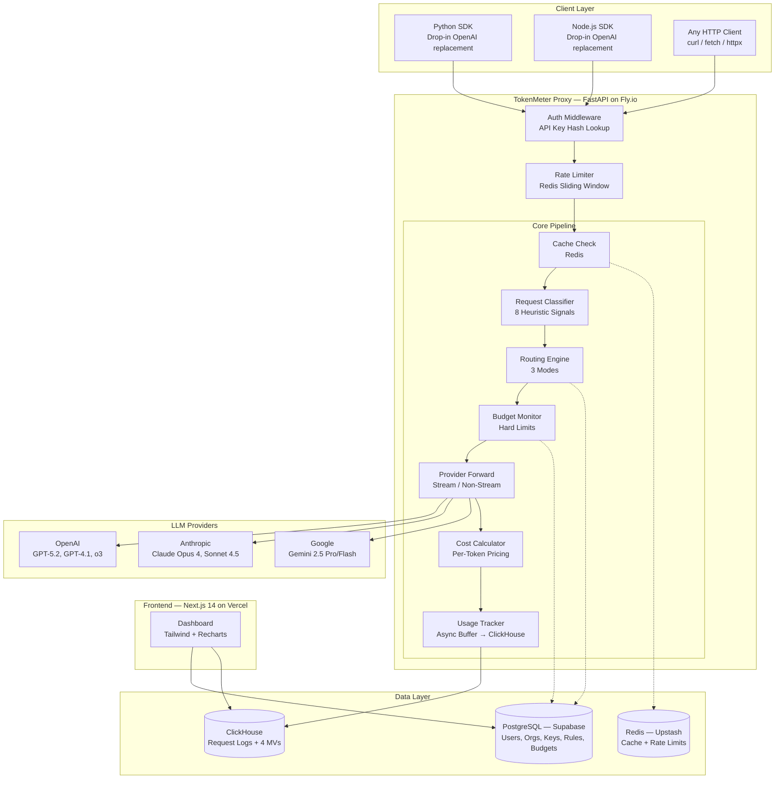
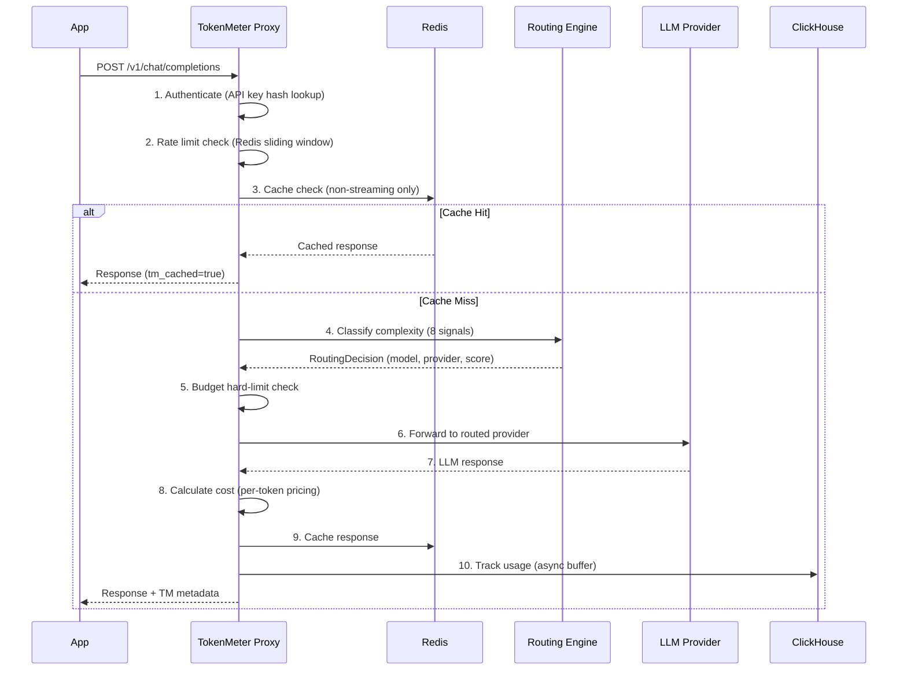
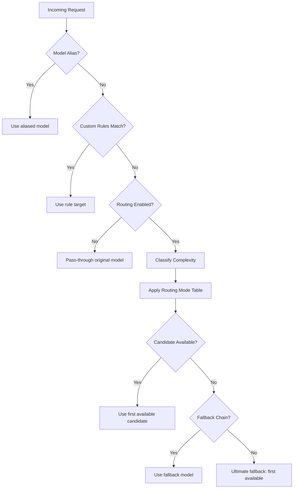
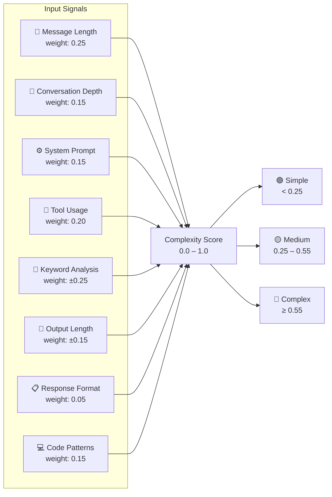
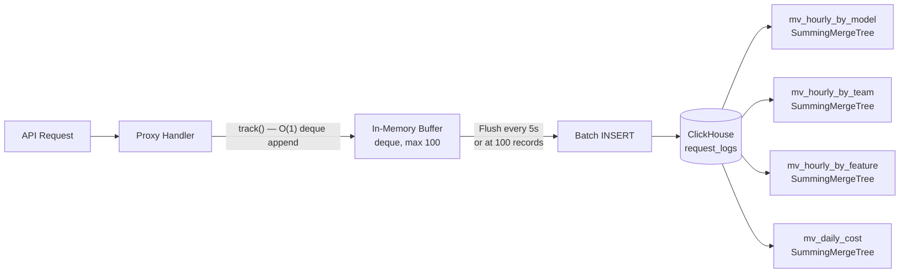
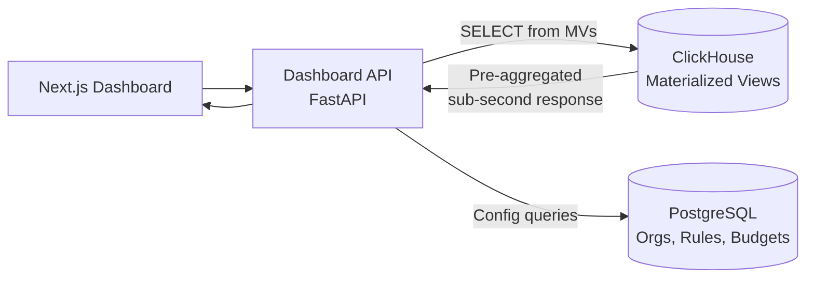
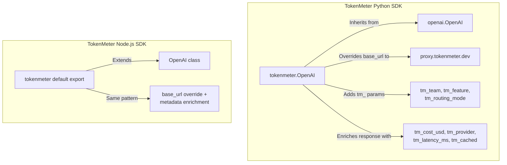
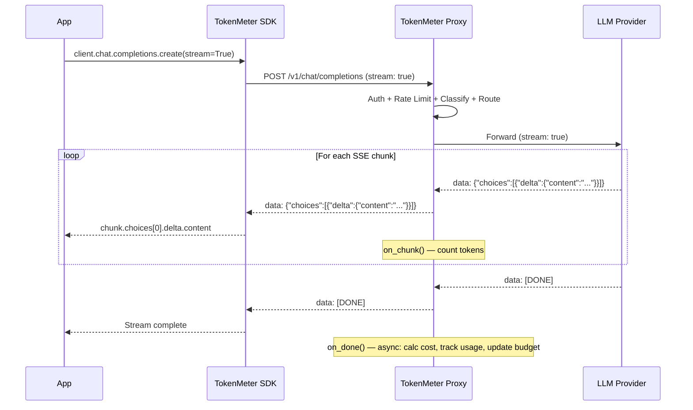
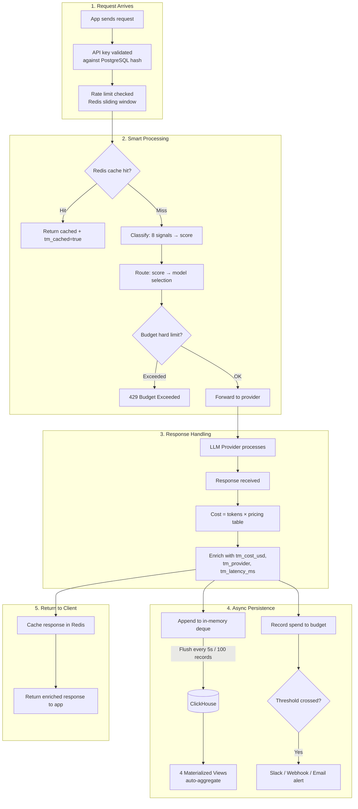
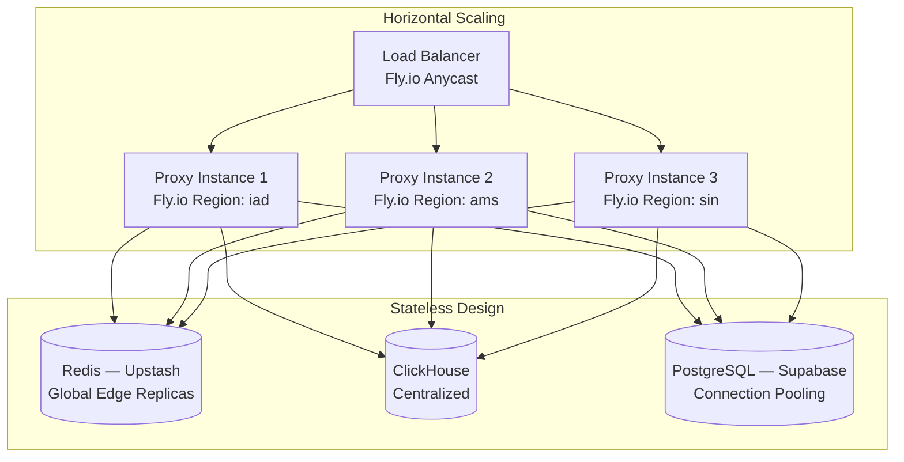

# 🎯 TokenMeter — Interview Preparation Guide

> **Role Target:** DevOps / MLOps / Backend Engineer
> **Last Updated:** February 2026

---

## 1. Project Overview — The 30-Second Pitch

**"I built TokenMeter — an open-source LLM API cost tracker and smart router. It's a drop-in proxy that sits between your application and LLM providers like OpenAI, Anthropic, and Google. It tracks every token, dollar, and millisecond in real-time, gives you dashboards to see exactly where your AI budget goes, and uses smart routing to automatically send simple queries to cheap models and complex ones to powerful models — saving up to 60% on LLM costs. Integration takes one line of code."**

### The Problem TokenMeter Solves

Companies running AI in production face a critical blind spot: **they don't know what they're spending on LLM APIs**. A chatbot team uses GPT-5, search uses Claude, embeddings use Gemini — and the monthly bill lands somewhere between $500 and $50,000 with zero visibility into which feature, team, or model is responsible.

Worse, every request gets sent to the same expensive model regardless of complexity. A "Hi, how are you?" costs the same per-token as "Analyze this 10-page legal contract and identify all liability clauses." That's like taking a Ferrari to the grocery store.

### Why It Matters

| Pain Point | TokenMeter Solution |
|---|---|
| No cost visibility | Per-request tracking with team/feature attribution |
| Overspending on simple queries | Smart routing sends simple tasks to cheap models |
| No budget controls | Hard limits + threshold alerts (Slack, webhook, email) |
| Vendor lock-in | Multi-provider support with automatic fallback |
| Complex integration | One-line SDK change — drop-in OpenAI compatibility |

### Key Metrics

- **<5ms latency overhead** per proxied request
- **Up to 60% cost savings** with smart routing enabled
- **15+ LLM models** across 3 providers (OpenAI, Anthropic, Google)
- **Sub-second dashboard queries** via ClickHouse materialized views
- **Python + Node.js SDKs** with one-line integration

---

## 2. Architecture Deep-Dive

> 📸 **Reference:** `docs/diagrams/system-architecture.jpg`

### System Architecture Diagram



### Request Lifecycle — Sequence Diagram

> 📸 **Reference:** `docs/diagrams/proxy-flow.jpg`



### Tech Stack Decisions

| Decision | Choice | Why |
|---|---|---|
| **API framework** | FastAPI (Python) | Async-native, OpenAPI auto-docs, Pydantic validation, huge ecosystem |
| **Deployment** | Fly.io | Edge regions, fast cold starts, easy horizontal scaling, affordable |
| **Frontend** | Next.js 14 on Vercel | SSR/SSG, App Router, edge functions, zero-config deploy |
| **Config DB** | PostgreSQL (Supabase) | Referential integrity for orgs/keys/rules, managed, row-level security |
| **Metrics DB** | ClickHouse | Column-oriented, 100x faster aggregations than Postgres, materialized views |
| **Cache** | Redis (Upstash) | Serverless, per-request pricing, global edge replication |
| **Auth** | Clerk | Pre-built UI, org management, webhook sync, JWT verification |
| **Payments** | Stripe Billing | Usage-based billing, metered subscriptions, customer portal |

---

## 3. Core Components — Deep Technical Breakdown

### 3.1 Proxy Handler (`proxy_handler.py`)

The **heart of TokenMeter**. Orchestrates the entire request lifecycle in an 8-step pipeline:

```
Request → Auth → Rate Limit → Cache Check → Classify → Route → Budget Check → Forward → Cost Calc → Track → Respond
```

**Key design decisions:**
- **Single responsibility orchestrator** — delegates to specialized services (classifier, router, cost calc, tracker)
- **Dual-mode handling** — separate code paths for streaming (SSE) and non-streaming, sharing usage tracking logic
- **Pydantic `model_copy()`** — creates a modified request with the routed model without mutating the original
- **Error tracking** — even failed requests are logged to ClickHouse with error status for debugging
- **Budget-first** — hard limit check happens *before* forwarding to avoid spending money you don't have

**Streaming architecture:**
```python
# Callbacks accumulate metrics during streaming
async def on_chunk(chunk):    # Count tokens per chunk
async def on_done():          # Calculate cost, track usage after stream ends
```
The `on_chunk` callback approximates token counting (1 chunk ≈ 1 token), while `on_done` fires after `[DONE]` to log the final usage record asynchronously.

### 3.2 Request Classifier (`request_classifier.py`)

Classifies every request into **Simple / Medium / Complex** using 8 weighted heuristic signals:

| # | Signal | Score Impact | Logic |
|---|---|---|---|
| 1 | **Message length** | +0.25 (>5K chars), +0.15 (>1.5K), −0.1 (<200) | Total characters across all messages |
| 2 | **Conversation depth** | +0.15 (>5 turns), +0.05 (>2) | Count of user messages |
| 3 | **System prompt complexity** | +0.15 (>2K chars), +0.05 (>500) | System message total length |
| 4 | **Tool/function usage** | +0.2 (tools defined), +0.1 (tool calls present) | Presence and count of tool definitions |
| 5 | **Keyword analysis** | +0.25 (>3 complex hits), −0.15 (>2 simple hits) | Regex match against 60+ keyword sets |
| 6 | **Output length** | +0.15 (>4K max_tokens), −0.1 (<100) | Requested `max_tokens` parameter |
| 7 | **Structured output** | +0.05 (JSON mode / response_format) | Non-text response format requested |
| 8 | **Code patterns** | +0.15 (≥3 patterns), +0.05 (≥1) | Regex for ` ``` `, `def`, `class`, `import`, `function` |

**Classification thresholds:**
- **Complex:** score ≥ 0.55
- **Medium:** 0.25 ≤ score < 0.55
- **Simple:** score < 0.25

The score is clamped to [0.0, 1.0] and stored in ClickHouse alongside each request for routing analytics.

### 3.3 Routing Engine (`routing_engine.py`)

A **6-step decision cascade** that determines the optimal model for each request:



**Custom rules** are user-defined, priority-sorted, and can filter on: source models, complexity levels, teams, and features.

### 3.4 Cost Calculator & Pricing Registry (`pricing.py`)

Comprehensive pricing table for **15+ models** across 3 providers with per-million-token rates:

| Provider | Model | Input $/1M | Output $/1M | Cached $/1M |
|---|---|---|---|---|
| OpenAI | gpt-5.2 | $12.00 | $40.00 | $3.00 |
| OpenAI | gpt-4.1-nano | $0.10 | $0.40 | $0.025 |
| Anthropic | claude-opus-4 | $15.00 | $75.00 | $1.875 |
| Anthropic | claude-haiku-3.5 | $0.80 | $4.00 | $0.08 |
| Google | gemini-2.5-pro | $1.25 | $10.00 | $0.3125 |
| Google | gemini-2.5-flash | $0.15 | $0.60 | $0.0375 |

Each `ModelInfo` includes: quality_score (0-1), speed_score (0-1), capabilities list, context window, and max output tokens — all used by the routing engine.

### 3.5 Usage Tracker (`usage_tracker.py`)

Async buffered writer that decouples request handling from persistence:

- **In-memory deque** buffers up to 100 `UsageRecord` objects
- **Flush triggers:** every 5 seconds OR when buffer hits 100 records
- **Retry logic:** on flush failure, records are re-queued (up to 10× buffer size to prevent OOM)
- **Graceful shutdown:** `stop()` flushes remaining buffer before exit
- **Singleton pattern:** `get_usage_tracker()` returns module-level instance

This design adds **zero latency to the request path** — the `track()` call is a deque append (O(1)), and ClickHouse inserts happen in a background asyncio task.

---

## 4. Smart Routing — Deep Dive

> 📸 **Reference:** `docs/diagrams/smart-routing.jpg`

### The Core Insight

Not all LLM requests are created equal. "What's 2+2?" and "Write a comprehensive market analysis for the European renewable energy sector" don't need the same model. Smart routing exploits this insight to deliver **up to 60% cost savings** without sacrificing quality.

### The 8 Classification Signals



**Complex keywords** (60+ terms): `analyze`, `implement`, `refactor`, `debug`, `architecture`, `algorithm`, `prove`, `theorem`, `step-by-step`, `chain of thought`...

**Simple keywords** (30+ terms): `translate`, `summarize`, `tldr`, `classify`, `yes or no`, `what is`, `define`, `list`...

### The 3 Routing Modes

#### Mode 1: Cost-Optimized (Default — Up to 60% Savings)

| Complexity | Primary Model | Fallbacks | Input Cost |
|---|---|---|---|
| 🟢 Simple | gpt-4.1-nano | gemini-2.5-flash, claude-haiku-3.5 | **$0.10**/1M |
| 🟡 Medium | gpt-4.1-mini | gpt-4.1, claude-sonnet-4.5 | **$0.40**/1M |
| 🔴 Complex | gpt-4.1 | gpt-5, claude-sonnet-4.5, gemini-2.5-pro | **$2.00**/1M |

**Savings math:** If 70% of your requests are simple (common in production):
- Without routing: 100% × GPT-4.1 = $2.00/1M avg
- With routing: (70% × $0.10) + (20% × $0.40) + (10% × $2.00) = **$0.35/1M avg** → **82% savings**

#### Mode 2: Latency-Optimized (2-5× Faster)

Routes to fastest available model at each complexity tier. Simple → nano/flash (fastest), Complex → 4.1/sonnet (fast but capable).

#### Mode 3: Quality-Optimized (Best Quality Within Budget)

Routes to most capable model at each tier. Simple → mini/sonnet, Medium → GPT-5/pro, Complex → GPT-5.2/opus-4/o3.

### Custom Routing Rules

Users can define priority-sorted rules that override default routing:

```python
RoutingRule(
    name="Search always uses Gemini Flash",
    priority=100,
    teams=["search"],
    target_model="gemini-2.5-flash",
    enabled=True,
)

RoutingRule(
    name="Complex code tasks use Opus",
    priority=90,
    complexity_levels=[ComplexityLevel.complex],
    features=["code-review", "refactoring"],
    target_model="claude-opus-4",
)
```

### Fallback Chain

If the primary candidate isn't available (provider down, no API key configured), the engine tries:
1. Other candidates in the same tier
2. User-configured fallback models
3. The originally requested model
4. Ultimate fallback: first available model in the registry

This ensures **zero downtime** even during provider outages.

---

## 5. ClickHouse & Analytics Pipeline

> 📸 **Reference:** `docs/diagrams/data-pipeline.jpg`

### Why ClickHouse Over PostgreSQL for Metrics?

| Criteria | PostgreSQL | ClickHouse |
|---|---|---|
| **Query type** | OLTP (row lookups) | OLAP (aggregations) |
| **"Sum cost by model for last 30 days"** | ~2-5s at 10M rows | **~50ms** at 10M rows |
| **Compression** | ~1x | **10-40x** (column-oriented) |
| **Materialized views** | Manual refresh | **Incremental** (auto-update on insert) |
| **Partitioning** | Manual setup | Built-in (partition by month) |
| **TTL** | Manual cleanup | Built-in (auto-expire after 365 days) |

### Write Path — Async Buffered Pipeline



**Key design choices:**
- **Batch inserts**: ClickHouse is optimized for bulk writes, not single-row inserts. Buffering 100 records gives ~100× better insert throughput.
- **`SummingMergeTree` engine**: MVs use SummingMergeTree which auto-merges rows with the same ORDER BY key, keeping pre-aggregated data compact.
- **Monthly partitioning** (`PARTITION BY toYYYYMM(timestamp)`): enables fast partition pruning for time-range queries and easy TTL cleanup.
- **ORDER BY `(org_id, timestamp, id)`**: optimized for the most common query pattern — "show me this org's data for this time range."

### The `request_logs` Table — What Gets Tracked

Every single API call records 25 fields:

```sql
-- Identity
org_id, team, feature, api_key_id

-- Request routing
requested_model, routed_model, provider, endpoint, stream

-- Token metrics
prompt_tokens, completion_tokens, total_tokens

-- Cost breakdown
cost_usd, input_cost_usd, output_cost_usd

-- Performance
latency_ms, time_to_first_token_ms

-- Status
status, status_code, error_message

-- Routing metadata
routing_mode, complexity_score, cached
```

### The 4 Materialized Views

| View | GROUP BY | Key Metrics | Use Case |
|---|---|---|---|
| `mv_hourly_by_model` | org, hour, model, provider | requests, tokens, cost, p50/p95/p99 latency, errors, cache hits | Model comparison dashboards |
| `mv_hourly_by_team` | org, hour, team | requests, tokens, cost, avg latency | Team cost attribution |
| `mv_hourly_by_feature` | org, hour, feature | requests, tokens, cost, avg latency | Feature-level cost tracking |
| `mv_daily_cost` | org, day | requests, tokens, total/input/output cost | Billing summaries, trend charts |

### Read Path — Dashboard Queries



Dashboard **never queries raw `request_logs`** for aggregations — it always hits the materialized views, which are pre-computed and incrementally maintained. This gives sub-second response times even with millions of logged requests.

### TTL & Data Lifecycle

- **Raw logs:** 365-day TTL (auto-deleted by ClickHouse)
- **Materialized views:** Inherit the same TTL
- **PostgreSQL config data:** No TTL (retained indefinitely)

---

## 6. SDK Architecture, Streaming & End-to-End Data Flow

### SDK Design Philosophy — "One Line to Integrate"

```python
# Before (standard OpenAI SDK)
from openai import OpenAI

# After (TokenMeter — literally one import change)
from tokenmeter import OpenAI
```

The SDKs achieve this by **wrapping the official provider SDKs** rather than re-implementing them:



**Why this approach?**
- **Zero learning curve** — developers already know the OpenAI SDK
- **Full compatibility** — all OpenAI features (streaming, functions, vision) work unchanged
- **Type safety** — TypeScript types extend OpenAI's types with `tm_` fields
- **Transparent proxy** — the SDK just points to our proxy; the proxy does the heavy lifting

### Streaming Architecture (SSE)



**Key streaming details:**
- **Zero buffering** — chunks are forwarded immediately (no waiting for full response)
- **Token estimation** — during streaming, 1 chunk ≈ 1 completion token (approximation)
- **Provider usage override** — if the provider sends final usage in the last chunk, we use that instead of the estimate
- **TTFT tracking** — Time to First Token is captured as the delta between request start and first chunk arrival
- **Async post-processing** — cost calculation and usage tracking happen *after* the stream ends, adding zero latency to chunk delivery

### End-to-End Data Flow — Complete Walkthrough



### Custom Headers & Extensions

The proxy accepts custom metadata via HTTP headers or SDK parameters:

| Header / Param | Purpose | Example |
|---|---|---|
| `X-TM-Team` / `tm_team` | Cost attribution to team | `"chatbot"`, `"search"` |
| `X-TM-Feature` / `tm_feature` | Cost attribution to feature | `"greeting"`, `"autocomplete"` |
| `X-TM-Routing-Mode` / `tm_routing_mode` | Override routing mode | `"cost-optimized"`, `"quality-optimized"` |

---

## 7. Security, Scalability & Performance

### Security Model

**API Key Security:**
- API keys are **never stored raw** — only SHA-256 hashes stored in PostgreSQL (`key_hash VARCHAR(128) UNIQUE`)
- Keys have a visible prefix (`tm_abc...`) for identification without exposing the full key
- **Scopes** control what a key can access: `proxy`, `dashboard`, or both
- Keys support **expiration** and **revocation**
- Provider credentials (OpenAI/Anthropic/Google API keys) are **encrypted at rest** using `pgcrypto`

```sql
-- API key: only hash stored
key_hash VARCHAR(128) NOT NULL UNIQUE,
key_prefix VARCHAR(20) NOT NULL,  -- "tm_abc..."

-- Provider credentials: encrypted
api_key_encrypted BYTEA NOT NULL,  -- pgcrypto
```

**Zero-Logging Option:**
- Request/response **content is never stored** — only metadata (tokens, cost, latency, model)
- ClickHouse stores only numerical metrics and categorical tags
- No PII in the analytics pipeline

**Network Security:**
- All proxy traffic over HTTPS/TLS
- Clerk JWT verification for dashboard authentication
- Rate limiting via Redis sliding window to prevent abuse
- CORS configuration for dashboard origin

### Scalability Architecture



**Why each proxy instance is stateless:**
- **No local state** — all shared state lives in Redis/ClickHouse/PostgreSQL
- **Usage tracker buffer** — the only in-memory state, but it's per-instance and flushes every 5 seconds. On instance restart, at most 5 seconds of data could be lost (acceptable for metrics)
- **Horizontal scaling** — add more Fly.io instances to handle more throughput with zero code changes
- **Multi-region** — Fly.io's anycast routing sends requests to the nearest proxy instance

**Database scaling:**
- **ClickHouse** — partitioned by month, TTL auto-cleanup, SummingMergeTree merges in background
- **PostgreSQL** — Supabase handles connection pooling (PgBouncer), read replicas available
- **Redis** — Upstash serverless scales automatically, global edge replication for reads

### Performance — The <5ms Overhead Budget

The entire proxy pipeline adds less than 5ms of overhead. Here's the breakdown:

| Step | Time | Notes |
|---|---|---|
| API key hash lookup | ~0.5ms | Redis-cached after first lookup |
| Rate limit check | ~0.3ms | Redis INCR + TTL |
| Cache check | ~0.5ms | Redis GET (cache miss is just a miss) |
| Request classification | ~0.2ms | Pure Python, in-memory heuristics, no I/O |
| Routing decision | ~0.1ms | In-memory lookup tables |
| Budget check | ~0.3ms | In-memory cached budgets |
| Usage tracking | ~0.05ms | Deque append — O(1), no I/O |
| Cost calculation | ~0.05ms | In-memory pricing table lookup |
| **Total overhead** | **~2ms** | Well within 5ms budget |

**What's NOT in the hot path:**
- ClickHouse writes (async background flush)
- Budget alert delivery (async)
- Cache writes (fire-and-forget)
- PostgreSQL queries (config is loaded at startup and cached)

### Resilience Patterns

| Pattern | Implementation |
|---|---|
| **Circuit breaker** | Provider registry marks providers as unavailable after repeated failures |
| **Retry with backoff** | Usage tracker retries failed ClickHouse flushes (bounded re-queue) |
| **Graceful degradation** | If ClickHouse is down, metrics are logged in-memory only |
| **Fallback chain** | Routing engine cascades through alternatives if primary provider fails |
| **Budget safety** | Hard limits checked *before* forwarding — never overspend |

---

## 8. Interview Questions — Architecture & Design (15 Questions)

### Q1: "Tell me about a project you've built recently."

**Elevator:** "I built TokenMeter — an LLM API cost tracker and smart router. It's a proxy that sits between apps and AI providers, tracks every dollar spent, and uses smart routing to cut costs by up to 60%."

**Detailed:** "The problem is that companies running AI in production have zero visibility into their LLM spend. TokenMeter is a drop-in proxy — you change one import line in your Python or Node.js code, and every request flows through our pipeline. We classify request complexity using 8 heuristic signals, route simple queries to cheap models like GPT-4.1-nano and complex ones to GPT-4.1 or Claude. Everything is tracked in ClickHouse with materialized views for sub-second dashboard queries. The backend is FastAPI on Fly.io, frontend is Next.js on Vercel, with PostgreSQL for config and Redis for caching."

**Power Move:** "The smart routing alone can save 60-80% on LLM costs. For a company spending $10K/month on AI, that's $6-8K saved per month — just by pointing their SDK at our proxy."

---

### Q2: "Why did you choose this architecture? What were the alternatives?"

**Elevator:** "I chose a proxy architecture because it's transparent to existing code, doesn't require SDK vendor lock-in, and centralizes all the intelligence."

**Detailed:** "I evaluated three approaches: (1) a client-side library that intercepts calls locally, (2) an agent-based approach with a sidecar per service, and (3) a centralized proxy. The proxy won because it provides a single point of control for routing, budgets, and analytics. Client libraries fragment logic across services and can't enforce budget hard limits server-side. Sidecars add operational overhead. The proxy adds <5ms overhead because the hot path is all in-memory — classification is pure heuristics, routing is lookup tables, and usage tracking is a deque append. ClickHouse writes happen async."

**Power Move:** "The proxy pattern is the same architecture that companies like Cloudflare and Envoy use. It's battle-tested for transparency and centralized control."

---

### Q3: "Why ClickHouse instead of just using PostgreSQL for everything?"

**Elevator:** "ClickHouse is a columnar OLAP database optimized for aggregation queries — it's 100x faster than PostgreSQL for our dashboard analytics."

**Detailed:** "Our dashboard needs to answer questions like 'what's the total cost by model for the last 30 days across 10 million requests.' In PostgreSQL, that's a full table scan taking 2-5 seconds. In ClickHouse with materialized views, it's a pre-aggregated lookup taking ~50ms. ClickHouse also gives us 10-40x compression, built-in partitioning by month, TTL-based auto-cleanup, and SummingMergeTree materialized views that incrementally maintain aggregations on every insert — no cron jobs or manual refreshes needed."

**Power Move:** "I used PostgreSQL for what it's good at — referential integrity for orgs, users, API keys, and routing rules. And ClickHouse for what it's good at — time-series aggregations. Each database does what it's designed for."

---

### Q4: "How does the smart routing actually work?"

**Elevator:** "We classify each request's complexity using 8 signals — message length, conversation depth, tool usage, keywords, code patterns — and route to the cheapest model that can handle that complexity level."

**Detailed:** "The classifier produces a score between 0 and 1. Scores below 0.25 are 'simple' (routed to nano/flash), 0.25-0.55 are 'medium' (routed to mini), and above 0.55 are 'complex' (routed to full models). The signals are weighted — tool usage (+0.2) and keyword analysis (±0.25) have the highest impact. The routing engine then runs a 6-step cascade: check model aliases, check custom rules, check if routing is enabled, classify, pick from the routing table, and fall back if needed. Users can define custom rules like 'all search team requests go to Gemini Flash.'"

**Power Move:** "The heuristic approach is intentional — it adds 0.2ms with zero API calls. An ML-based classifier would add latency and need training data. For production proxying, speed and predictability matter more than perfect classification."

---

### Q5: "How do you handle streaming responses?"

**Elevator:** "We use SSE (Server-Sent Events) pass-through — chunks are forwarded immediately with zero buffering, and metrics are collected via callbacks that fire on each chunk and on stream completion."

**Detailed:** "When `stream: true` is set, the proxy opens a streaming connection to the LLM provider and returns an async generator to the client. Each SSE chunk is forwarded immediately — no buffering. An `on_chunk` callback counts tokens (1 chunk ≈ 1 token approximation), and an `on_done` callback fires after the `[DONE]` signal to calculate cost, track usage in ClickHouse, and update budget spend. If the provider sends final usage data in the last chunk, we use that instead of our estimate. Time-to-first-token is captured as the delta between request start and first chunk."

**Power Move:** "The streaming path adds the same <5ms overhead as non-streaming because all post-processing is async. The user's perceived latency is determined entirely by the LLM provider, not by our proxy."

---

### Q6: "Walk me through what happens when a budget limit is exceeded."

**Elevator:** "We check hard limits before forwarding the request. If exceeded, we return a 429 immediately — no money is spent."

**Detailed:** "Budgets can be set per org, team, feature, model, or provider with configurable periods (monthly/weekly/daily). Each budget has multiple thresholds — say 50%, 80%, 100%. When spend crosses a threshold, we deliver alerts via Slack, webhook, or email. If a budget has `hard_limit: true` and it's exceeded, we reject the request with a 429 before it ever reaches the LLM provider. After each successful request, the cost calculator result is passed to the budget monitor's `record_spend()` method, which checks all applicable budgets and returns any triggered alerts for async delivery."

**Power Move:** "The key design choice is that budget checks happen *before* the expensive LLM call, not after. This is a safety-first design — you never accidentally overspend."

---

### Q7: "How did you design the database schema?"

**Elevator:** "Two databases, each optimized for its workload. PostgreSQL for relational config data with foreign keys. ClickHouse for time-series metrics with columnar storage and materialized views."

**Detailed:** "PostgreSQL stores 9 tables: organizations, users, memberships, API keys (hash-only), provider credentials (encrypted), routing rules, routing configs, budgets, budget alerts, subscriptions, and webhook endpoints. Everything has proper foreign keys and cascading deletes. ClickHouse has one raw table — `request_logs` — partitioned by month, ordered by (org_id, timestamp, id), with 4 materialized views that pre-aggregate by model, team, feature, and day. The SummingMergeTree engine auto-merges rows with the same key, keeping aggregation data compact."

**Power Move:** "The PostgreSQL schema supports multi-tenancy from day one. Every table has `org_id` foreign keys, and the ClickHouse ORDER BY starts with `org_id` — so queries are always scoped to a tenant efficiently."

---

### Q8: "How do you ensure the proxy doesn't become a single point of failure?"

**Elevator:** "Stateless proxy instances behind Fly.io's anycast load balancer, with graceful degradation for every dependency."

**Detailed:** "Each proxy instance is stateless — all shared state lives in Redis, ClickHouse, and PostgreSQL. Fly.io runs multiple instances across regions with anycast routing. If ClickHouse goes down, metrics are buffered in-memory. If Redis goes down, we skip caching and rate limiting (fail-open for availability). If a provider goes down, the routing engine's fallback chain switches to an alternative. The usage tracker re-queues failed flushes with a bounded buffer to prevent OOM. The only data at risk is up to 5 seconds of metrics in the in-memory buffer on instance crash — acceptable for analytics data."

**Power Move:** "I designed every component to degrade gracefully rather than fail catastrophically. The proxy always tries to complete the request — metrics are nice-to-have, but the LLM response is the core value."

---

### Q9: "How do you handle multi-tenancy?"

**Elevator:** "Every resource — API keys, routing rules, budgets, usage records — is scoped to an organization ID. ClickHouse queries always filter by org_id first."

**Detailed:** "PostgreSQL enforces multi-tenancy via foreign keys to `organizations(id)`. API keys belong to orgs, routing rules belong to orgs, budgets belong to orgs. In ClickHouse, the ORDER BY starts with `org_id`, meaning queries for one org's data are a fast prefix scan, never touching other tenants' data. Clerk handles org management with roles (owner, admin, member). The `org_memberships` table tracks who belongs to which org with UNIQUE(org_id, user_id) constraints."

**Power Move:** "The ClickHouse ORDER BY `(org_id, timestamp, id)` is a deliberate design choice — it makes every dashboard query for a single org a sequential scan on contiguous data, which is as fast as it gets in a columnar database."

---

### Q10: "What's your caching strategy?"

**Elevator:** "Redis-based response caching for non-streaming requests, keyed by the full request hash. Cache hits skip the LLM provider entirely but still count toward usage tracking."

**Detailed:** "For non-streaming requests, we hash the request (model, messages, parameters) and check Redis before routing. Cache hits return immediately with `tm_cached: true` — and still get tracked in ClickHouse as a cached request (this is important for accurate usage reporting). Streaming requests skip the cache because they need to be generated in real-time. The cache uses TTL-based expiration and is invalidated when routing rules change. We also use Redis for rate limit counters (sliding window) and API key lookup caching."

**Power Move:** "Caching doesn't just save money — it saves *latency*. A cached response returns in ~2ms instead of 200-2000ms from an LLM provider. For high-volume, repetitive queries like FAQ bots, caching alone can save 40-60% of requests."

---

### Q11: "How do you calculate costs accurately?"

**Elevator:** "A comprehensive pricing table with per-million-token rates for input, output, and cached input — updated for Feb 2026 prices across all 15+ models."

**Detailed:** "The `pricing.py` module defines `ModelInfo` objects for every supported model with `ModelPricing` containing `input_per_1m_tokens`, `output_per_1m_tokens`, and `cached_input_per_1m_tokens`. The cost calculator takes the routed model, prompt tokens, and completion tokens, and computes: `(prompt_tokens / 1M × input_rate) + (completion_tokens / 1M × output_rate)`. For streaming, we estimate tokens from chunk count during the stream and override with the provider's reported usage if available. Costs are stored to 8 decimal places in ClickHouse for precision."

**Power Move:** "I included cached input pricing because providers like OpenAI charge less for prompt caching hits — GPT-4.1's cached input is $0.50 vs $2.00 per 1M tokens. Tracking this separately gives users visibility into their caching effectiveness."

---

### Q12: "How do provider adapters work?"

**Elevator:** "Each provider has an adapter that translates between our OpenAI-compatible API format and the provider's native format."

**Detailed:** "We maintain full OpenAI API compatibility — that's our contract with clients. Under the hood, the `providers/` directory has adapters for OpenAI (direct pass-through), Anthropic (translate chat format to Messages API, handle different streaming format), and Google (translate to Gemini API format). Each adapter implements a base interface with `chat_completion()`, `chat_completion_stream()`, and `embeddings()` methods. The provider registry manages which providers are available based on configured API keys."

**Power Move:** "The adapter pattern means adding a new provider is a single file — implement the interface, add the pricing data, register it. We could add Mistral, Cohere, or any OpenAI-compatible provider in under an hour."

---

### Q13: "What would you change if you rebuilt this from scratch?"

**Elevator:** "I'd add an ML-based classifier trained on actual routing outcomes, and implement request deduplication for identical concurrent requests."

**Detailed:** "Three things: (1) The heuristic classifier works well for v1 but I'd train a small ML model on the actual routing outcomes — track which complexity scores led to successful/failed routing decisions and learn from that. (2) Request deduplication — if 10 users send the same query within seconds, we could serve one and cache for the rest. (3) I'd consider gRPC instead of REST for the proxy-to-provider communication to reduce serialization overhead, though REST is fine for our current <5ms budget."

**Power Move:** "But honestly, the heuristic classifier was the right v1 choice. It ships fast, is debuggable, and adds 0.2ms. An ML classifier would need training data that we'd only have after launch. Sometimes the pragmatic choice is better than the perfect one."

---

### Q14: "How do you handle schema migrations for ClickHouse?"

**Elevator:** "ClickHouse materialized views are append-only and idempotent — we version them with CREATE IF NOT EXISTS and can add new views without touching existing data."

**Detailed:** "ClickHouse doesn't have traditional schema migrations like Alembic for PostgreSQL. Instead, our approach is: (1) `CREATE TABLE IF NOT EXISTS` / `CREATE MATERIALIZED VIEW IF NOT EXISTS` for all DDL — idempotent and safe to re-run. (2) Adding new columns uses `ALTER TABLE ADD COLUMN IF NOT EXISTS` with defaults. (3) Adding new MVs is non-destructive — they start populating from new inserts. (4) For breaking changes, we'd create new tables/views and backfill. The monthly partitioning means we can drop old partitions cleanly if needed."

**Power Move:** "For PostgreSQL, I'd use Alembic or Supabase's built-in migration system. For ClickHouse, the schema is deliberately simple and additive — we avoid the need for complex migrations by design."

---

### Q15: "How does authentication work end-to-end?"

**Elevator:** "API keys for the proxy (hashed in PostgreSQL), Clerk JWTs for the dashboard. Two separate auth paths for two different audiences."

**Detailed:** "For the proxy: clients send `Authorization: Bearer tm_xxx` headers. The middleware hashes the key with SHA-256 and looks it up in `api_keys.key_hash`. If found, we load the org_id, scopes, and check expiration/revocation. The hash is cached in Redis after first lookup. For the dashboard: Clerk provides JWT-based authentication with org management. Users sign in via Clerk, and the dashboard API verifies the JWT to get the user and org context. Provider credentials (the actual OpenAI/Anthropic/Google API keys) are encrypted with pgcrypto and decrypted only in the proxy process memory."

**Power Move:** "API keys are *never* stored in plaintext — even if our database is compromised, attackers get SHA-256 hashes that can't be reversed to recover keys. This is the same approach used by Stripe and GitHub for API key security."

---

## 9. Interview Questions — Technical, SDK & DevOps (15 Questions)

### Q16: "How do you test a proxy that depends on external LLM APIs?"

**Elevator:** "Mock the provider adapters. Our adapter pattern makes it trivial to inject a fake provider that returns controlled responses without hitting real APIs."

**Detailed:** "Three testing layers: (1) Unit tests — mock the provider adapters and test the proxy handler pipeline end-to-end with deterministic responses. Test classification with crafted requests (known complexity scores). Test cost calculation with known token counts. (2) Integration tests — use a local ClickHouse instance (Docker) and real Redis to test the full write path. Verify materialized views produce correct aggregations. (3) End-to-end — a small suite that hits a real provider with minimal requests to verify adapter translations. We also have a comprehensive test suite for the classifier with edge cases: empty messages, very long inputs, tool-heavy requests, code-only content."

**Power Move:** "The adapter pattern isn't just for multi-provider support — it's fundamentally a testability design. Every external dependency is behind an interface that can be mocked in 3 lines."

---

### Q17: "How do you deploy and what's your CI/CD pipeline?"

**Elevator:** "GitHub Actions runs tests + linting on every PR. Main branch auto-deploys backend to Fly.io and frontend to Vercel."

**Detailed:** "The CI pipeline: (1) Python: pytest + mypy type checking + ruff linting + black formatting. (2) Node.js/Frontend: vitest + ESLint + TypeScript strict mode. (3) Docker: multi-stage build for the FastAPI backend — slim Python 3.12 image. (4) Fly.io deployment: `flyctl deploy` with health checks. Fly.io handles blue-green deploys with automatic rollback on health check failure. (5) Vercel: automatic preview deploys on every PR, production deploy on merge to main. (6) Database migrations: PostgreSQL migrations run as a pre-deploy step. ClickHouse DDL is idempotent (CREATE IF NOT EXISTS)."

**Power Move:** "Fly.io gives us multi-region deployment out of the box. We can scale from 1 instance in IAD to 5 instances across IAD, AMS, and SIN with a single config change — no code changes needed because the proxy is stateless."

---

### Q18: "How would you monitor this system in production?"

**Elevator:** "We eat our own dog food — TokenMeter tracks its own metrics. Plus standard observability: structured logging, health endpoints, and ClickHouse-powered dashboards."

**Detailed:** "Monitoring layers: (1) Application metrics — ClickHouse stores p50/p95/p99 latency, error rates, cache hit rates per model/team/feature. The materialized views power real-time dashboards. (2) Infrastructure — Fly.io metrics for CPU/memory/network, Supabase dashboard for PostgreSQL, Upstash dashboard for Redis. (3) Logging — structured JSON logs via Python's logging module. Every request logs: routing decision, latency, cost, status, any errors. (4) Alerting — budget alerts (our own feature), plus we'd set up Fly.io alerts for instance health. (5) Health endpoint — `/health` checks PostgreSQL, ClickHouse, and Redis connectivity. The usage tracker exposes `stats` property showing total tracked/flushed/buffer size and ClickHouse connection status."

**Power Move:** "The `mv_hourly_by_model` materialized view tracks `error_count` and `cache_hits` — so our dashboard doubles as our monitoring dashboard. We can see error rate spikes and cache effectiveness in real-time without a separate monitoring stack."

---

### Q19: "How do you handle concurrent requests and race conditions?"

**Elevator:** "Python's asyncio gives us cooperative concurrency. The in-memory buffer uses a deque (thread-safe for appends), and budget checks use atomic operations."

**Detailed:** "FastAPI runs on uvicorn with asyncio — each request is a coroutine, and Python's GIL prevents true concurrency issues for in-memory data structures. The usage tracker's `deque` is safe for concurrent appends. The flush loop is a single asyncio task that clears the buffer atomically. For budget tracking, Redis INCR is atomic, so concurrent spend updates don't race. For ClickHouse batch inserts, we clear the buffer before inserting — if the insert fails, records are re-queued. The only potential issue is budget hard limit checks with concurrent requests: two requests could both pass the limit check before either's cost is recorded. For the MVP, this is acceptable — the budget might be exceeded by one request's cost."

**Power Move:** "For strict budget enforcement at scale, I'd use a Redis-based atomic check-and-increment: `INCR budget:org:123 by $cost` and check the result atomically. But for the current scale, in-memory checks with eventual consistency are simpler and fast."

---

### Q20: "Walk me through the SDK architecture. Why not just tell users to change their base URL?"

**Elevator:** "The SDK does more than change the base URL — it extends the response with cost/latency/provider metadata and provides type-safe tm_ parameters."

**Detailed:** "Users can use the raw proxy by just changing the base URL — and that's Option 3 in our README. But the SDK adds value: (1) Type-safe parameters — `tm_team`, `tm_feature`, `tm_routing_mode` are validated at the IDE level. (2) Response enrichment — `response.tm_cost_usd`, `response.tm_provider`, `response.tm_latency_ms` are available as typed properties. (3) Zero config — the SDK auto-discovers the API key from environment variables. (4) Future-proof — we can add client-side features like automatic retries, local token counting, or offline mode without users changing code. The SDK inherits from the official OpenAI client class, so every existing feature (streaming, function calling, vision) works unchanged."

**Power Move:** "The one-import-line integration isn't marketing — it's architectural. We literally extend the OpenAI class. `from tokenmeter import OpenAI` is semantically identical to `from openai import OpenAI` plus superpowers."

---

### Q21: "How do you handle provider-specific API differences?"

**Elevator:** "Adapter pattern. Each provider has an adapter that translates between our OpenAI-compatible format and the provider's native API."

**Detailed:** "OpenAI is our API contract — clients always send OpenAI-format requests. The adapters handle translation: (1) Anthropic — convert `messages` array to Anthropic's Messages API format. Anthropic uses separate `system` parameter instead of a system message. Streaming chunks have different JSON structure. Tool calling uses different field names. (2) Google — convert to Gemini API format with `contents` instead of `messages`, `parts` instead of `content`. Different streaming format. (3) OpenAI — nearly pass-through, just strip the `tm_` fields before forwarding. Each adapter implements `chat_completion()`, `chat_completion_stream()`, and `embeddings()`. The `provider_registry` maps model IDs to providers and manages credentials."

**Power Move:** "This means when a new model launches — say GPT-5.3 — I just add it to `pricing.py` and it works immediately. No adapter changes needed unless the API format changes."

---

### Q22: "What's the most challenging technical problem you solved in this project?"

**Elevator:** "Accurate token counting and cost tracking for streaming responses — where you don't know the total until the stream ends."

**Detailed:** "The challenge: for non-streaming, the provider returns `usage.prompt_tokens` and `usage.completion_tokens` in the response. Easy. For streaming, tokens arrive one chunk at a time, and most providers don't send final usage until the last chunk — or don't send it at all. My solution: (1) Pre-estimate prompt tokens using `tiktoken` before the stream starts. (2) During streaming, count chunks as an approximation (1 chunk ≈ 1 token — close enough for cost estimation). (3) After stream completion, check if the provider sent final usage data and override our estimate if available. (4) All of this happens in callbacks (`on_chunk`, `on_done`) that don't block chunk delivery. The result: accurate cost tracking for streaming with zero added latency."

**Power Move:** "I also capture TTFT (Time to First Token) — the delta between request start and first chunk. This is a critical SLA metric for real-time applications like chatbots where perceived latency matters more than total latency."

---

### Q23: "How do you handle rate limiting?"

**Elevator:** "Redis-based sliding window rate limiter. Configurable per-org and per-API-key, checked in the middleware before any business logic."

**Detailed:** "The rate limiter uses Redis's atomic INCR + EXPIRE for a sliding window approach. Each org/key gets a counter keyed by `ratelimit:{org_id}:{window}`. Windows are configurable — typically 1000 requests/minute for free tier, 10,000 for pro. The middleware checks this before routing, classification, or any other processing. If exceeded, we return 429 with `Retry-After` headers. The sliding window is more fair than fixed windows because it doesn't have the burst problem at window boundaries."

**Power Move:** "Rate limiting is one of the few places where we fail-open if Redis is down. A temporary loss of rate limiting is better than rejecting all requests because Redis had a blip."

---

### Q24: "How would you add a new LLM provider — say Mistral?"

**Elevator:** "Three steps: add a provider adapter file, add pricing data, register it. Under an hour of work."

**Detailed:** "Step 1: Create `providers/mistral.py` implementing the base adapter interface — `chat_completion()`, `chat_completion_stream()`, `embeddings()`. Handle any API format differences (Mistral is very OpenAI-compatible, so minimal translation). Step 2: Add `MISTRAL_MODELS` to `pricing.py` with ModelInfo objects including pricing, capabilities, quality/speed scores. Step 3: Register the provider in `provider_registry.py`. Step 4: Add the provider's credential storage to PostgreSQL's `provider_credentials` table (already supports any provider string). Step 5: Update the routing tables to include Mistral models as candidates. The entire system is designed for provider extensibility."

**Power Move:** "Because we store `provider` as a string (not an enum) in ClickHouse, analytics start working immediately for the new provider — no schema migration needed."

---

### Q25: "How do you handle secrets management?"

**Elevator:** "Layered approach: environment variables for service secrets, pgcrypto encryption for user provider credentials, SHA-256 hashing for API keys."

**Detailed:** "Three layers: (1) Infrastructure secrets (database passwords, service API keys) — environment variables managed by Fly.io's secrets system, never in code. (2) User API keys — stored as SHA-256 hashes in PostgreSQL. The original key is only seen at creation time and returned to the user once. (3) Provider credentials (user's OpenAI/Anthropic/Google API keys) — encrypted at rest using pgcrypto's `BYTEA` type. Decrypted only in the proxy process memory when forwarding requests. The encryption key is an environment variable."

**Power Move:** "We never log or store request/response content. Only metadata: tokens, cost, latency, model. This means even if every database is compromised, no user data is exposed — just aggregated usage statistics."

---

### Q26: "How do you handle the Python SDK's compatibility with different OpenAI SDK versions?"

**Elevator:** "We pin a minimum OpenAI SDK version and use feature detection for newer APIs."

**Detailed:** "The Python SDK inherits from `openai.OpenAI` and adds `tm_` extensions. We pin `openai>=1.0` as a dependency. For newer features like structured output or vision, we pass through unchanged — our SDK doesn't intercept or modify them. The `tm_` parameters are custom extensions that the proxy strips before forwarding. For response enrichment, we add `tm_` fields to the response object using Python's dynamic attribute setting. This means any future OpenAI SDK feature works automatically — we're a transparent wrapper."

**Power Move:** "This is why I chose inheritance over composition. If I wrapped the client, I'd need to proxy every method. By inheriting, new methods work for free."

---

### Q27: "What's your approach to error handling?"

**Elevator:** "Every error is tracked — even failed requests get logged to ClickHouse with error status. Provider errors are translated to appropriate HTTP codes."

**Detailed:** "Error handling happens at multiple levels: (1) Authentication errors — 401 with clear message. (2) Rate limit exceeded — 429 with Retry-After. (3) Budget exceeded — 429 with budget details. (4) Provider errors — pass through the provider's status code and message (most return 4xx/5xx). (5) Internal errors — 500 with generic message (no internal details leaked). Every error, including provider failures, is tracked via `_track_usage()` with `status=RequestStatus.error` and the error message. This means we can graph error rates per model/provider in the dashboard. The streaming error path is trickier — if the error occurs mid-stream, we log it on the `on_done` path."

**Power Move:** "Tracking errors in ClickHouse isn't just for debugging — it feeds into routing decisions. If a provider's error rate spikes, the routing engine's fallback chain kicks in automatically."

---

### Q28: "How do you handle database connection pooling?"

**Elevator:** "Supabase handles PostgreSQL pooling via PgBouncer. ClickHouse connections use a session-based aiohttp client. Redis is serverless via Upstash."

**Detailed:** "Three different strategies for three databases: (1) PostgreSQL — Supabase provides PgBouncer-based connection pooling out of the box, supporting thousands of concurrent connections with transaction-mode pooling. (2) ClickHouse — we use `aiochclient` with an `aiohttp.ClientSession`, which pools HTTP connections internally. Since we batch inserts every 5 seconds, we only need a few connections. (3) Redis — Upstash is serverless and HTTP-based, so there's no traditional connection pooling. Each operation is an independent HTTPS request. For high-throughput scenarios, we'd switch to a connection-based Redis client with pooling."

**Power Move:** "By using managed services (Supabase, Upstash), I offload operational complexity of connection pooling to teams that specialize in it. That lets me focus on business logic instead of infrastructure."

---

### Q29: "What observability do you have into the routing decisions?"

**Elevator:** "Every routing decision is stored: the original model, the routed model, the complexity score, the routing mode, and whether it was rerouted — all queryable in ClickHouse."

**Detailed:** "The `request_logs` table stores: `requested_model`, `routed_model`, `routing_mode`, `complexity_score`, and `cached`. The dashboard can show: (1) What percentage of requests are being rerouted, (2) The distribution of complexity scores, (3) Cost savings from routing (diff between requested model price and routed model price), (4) Which routing rules are firing most often. We also log classification signals at DEBUG level, so in development you can see exactly which signals contributed to each score."

**Power Move:** "This data creates a feedback loop. If we see that requests classified as 'simple' that were sent to nano models have higher error rates, we can adjust the classification thresholds. The routing system is data-driven and self-improving."

---

### Q30: "How do you handle configuration changes — like new routing rules — without restarting the proxy?"

**Elevator:** "Routing configs and rules are loaded from PostgreSQL on each request's routing step. Budget configs are periodically refreshed."

**Detailed:** "The routing engine is instantiated per-request with the current set of available models. Routing rules live in PostgreSQL and are loaded when the engine evaluates them. This means a new routing rule takes effect immediately — no restart, no cache invalidation. Budget configs are loaded and cached in memory with periodic refresh. For hot config changes (like enabling/disabling routing), the dashboard API updates PostgreSQL, and the next request picks up the change. Redis cache TTLs ensure stale cached responses eventually expire when routing rules change."

**Power Move:** "This is a classic runtime configuration pattern — store config in a database, load at decision time, cache judiciously. It's simpler than complex config reload mechanisms and just as effective at our scale."

---

## 10. Interview Questions — Business & Talking Points (5 Questions + Cheat Sheet)

### Q31: "What's the business model?"

**Elevator:** "Freemium SaaS — free tier for small teams, paid plans based on request volume and features."

**Detailed:** "Three tiers: (1) **Free** — 10,000 requests/month, 1M tokens, 2 API keys, 3 team members, basic dashboard and cost tracking. (2) **Pro** ($49/month) — 100K requests/month, 10M tokens, unlimited keys, 10 members, smart routing, budget alerts, priority support. (3) **Enterprise** (custom) — unlimited everything, SSO, SLA, dedicated support, on-prem option. Revenue also comes from usage-based overages on the Pro plan. Stripe Billing handles subscription management, usage metering, and customer portal."

**Power Move:** "The free tier is generous enough to hook teams during evaluation. Once they see the cost savings from smart routing, upgrading is a no-brainer — $49/month to save $2,000+/month on AI costs."

---

### Q32: "Who are your competitors and how do you differentiate?"

**Elevator:** "Main competitors are Helicone, LangSmith, and Portkey. We differentiate with smart routing (they only track, we optimize) and one-line SDK integration."

**Detailed:** "Helicone — great logging/observability but no smart routing or cost optimization. LangSmith — focused on LLM application development lifecycle, not cost tracking. Portkey — closest competitor with proxy + observability, but our smart routing and heuristic classifier are unique. Our key differentiators: (1) Smart routing with automated complexity classification — no one else does this. (2) One-line SDK integration — lower barrier to adoption than any competitor. (3) Budget hard limits — we can actually *prevent* overspend, not just alert on it. (4) ClickHouse-powered analytics with sub-second dashboards."

**Power Move:** "The market is growing 10x per year as AI adoption accelerates. There's room for multiple winners, and our smart routing is a unique value prop that turns 'cost tracking' from a nice-to-have into a must-have."

---

### Q33: "How would you scale this to handle 10x or 100x current load?"

**Elevator:** "The architecture is already designed for it — stateless proxies scale horizontally, ClickHouse handles billions of rows, Redis is serverless."

**Detailed:** "At 10x: Add more Fly.io instances across regions (config change, no code change). ClickHouse handles 10x more data with the same schema — partitioning and MVs keep queries fast. Redis scales automatically (Upstash serverless). At 100x: (1) Shard ClickHouse across multiple nodes for write throughput. (2) Add read replicas for PostgreSQL. (3) Implement request deduplication (identical concurrent requests share one LLM call). (4) Consider a message queue (Kafka/SQS) between proxy and ClickHouse for even more write buffering. (5) Add a CDN layer for static dashboard assets. The stateless proxy design means compute scaling is linear and easy."

**Power Move:** "The hardest part of scaling isn't compute — it's data. That's why I chose ClickHouse from day one instead of starting with PostgreSQL for metrics and migrating later. The right database choice at the start saves months of painful migration."

---

### Q34: "What metrics would you track to measure success?"

**Elevator:** "Three categories: user adoption (MAU, request volume), value delivered (cost savings, routing accuracy), and business (MRR, churn, expansion revenue)."

**Detailed:** "Product metrics: (1) Monthly active users, (2) Total requests proxied/month, (3) Total cost tracked (larger = more sticky), (4) Smart routing adoption rate, (5) Average cost savings per org. Technical metrics: (1) Proxy latency p50/p95/p99, (2) Error rate by provider, (3) Cache hit rate, (4) Classification accuracy (tracked via the routing outcome data). Business metrics: (1) MRR growth, (2) Free-to-paid conversion rate, (3) Net revenue retention, (4) Time to first value (how fast from signup to first tracked request)."

**Power Move:** "The most important metric is 'dollar amount saved per customer per month.' If we can show a customer they saved $3,000 this month, they'll never churn. That's our north star."

---

### Q35: "What did you learn from building this project?"

**Elevator:** "Three things: the right database for the right job, the power of the proxy pattern, and the importance of pragmatic engineering over perfect engineering."

**Detailed:** "(1) **Database selection matters enormously.** Using ClickHouse for metrics instead of PostgreSQL was a 100x performance difference for aggregation queries. The lesson: don't use one database for everything. (2) **The proxy pattern is incredibly powerful.** By sitting in the request path, we get complete visibility and control without changing application code. It's the same pattern used by CDNs, API gateways, and service meshes — and for good reason. (3) **Pragmatic beats perfect.** The heuristic classifier adds 0.2ms and is 'good enough.' An ML classifier would be 'better' but would add latency, need training data, and take weeks to build. Ship the simple version, measure, iterate."

**Power Move:** "I also learned to think about developer experience as a first-class feature. The one-line SDK integration isn't a gimmick — it's the reason developers actually adopt the tool instead of bookmarking it and forgetting about it."

---

## 🎤 Interview Cheat Sheet — Quick-Fire Talking Points

### Architecture Buzzwords You Can Back Up

| Term | How You Used It | Where |
|---|---|---|
| **Event-driven** | Async usage tracking with buffered writes | Usage Tracker |
| **CQRS** | Separate write path (ClickHouse inserts) and read path (MV queries) | Data Pipeline |
| **Adapter pattern** | Provider-specific API translation behind a common interface | Provider Adapters |
| **Proxy pattern** | Transparent intermediary for request interception | Core Architecture |
| **Circuit breaker** | Provider fallback on failure | Routing Engine |
| **Materialized views** | Pre-computed aggregations for sub-second queries | ClickHouse |
| **Multi-tenancy** | Org-scoped data with efficient partitioning | DB Schema |
| **Heuristic classification** | 8-signal complexity scoring without ML overhead | Request Classifier |
| **SSE streaming** | Zero-buffering chunk forwarding with async metrics | Streaming Handler |
| **Graceful degradation** | Every dependency fails open (except budget limits) | Resilience Design |

### Numbers to Drop

- **<5ms** proxy overhead (2ms typical)
- **Up to 60%** cost savings with smart routing
- **15+** models across 3 providers
- **8** classification signals
- **4** ClickHouse materialized views
- **100-record / 5-second** flush buffer
- **0.2ms** classification time (pure heuristics, no I/O)
- **25** fields tracked per request
- **365-day** data TTL with auto-cleanup
- **9** PostgreSQL tables with full referential integrity

### "Why Should We Hire You?" Closer

> "I built TokenMeter because I saw a real problem — companies bleeding money on LLM APIs with zero visibility. I didn't just build a toy project; I built production-grade infrastructure with async buffered writes, columnar analytics, multi-provider routing, and sub-5ms overhead. I chose boring, proven technologies (FastAPI, PostgreSQL, ClickHouse, Redis) and composed them into something that solves a $10B+ market problem. I care about developer experience (one-line integration), operational excellence (graceful degradation, auto-cleanup), and pragmatic engineering (heuristic classifier that ships in days, not an ML model that takes months). I build things that work, and I build them to scale."

---

---

## System Design Whiteboard Walkthrough

> Use when interviewer says: "Design a proxy that tracks LLM API costs and routes requests to the optimal provider."

### Step 1: Requirements Gathering

**Functional Requirements:**
- Transparent proxy between applications and LLM providers (OpenAI, Anthropic, Google)
- Track cost, tokens, latency, and provider for every request
- Smart routing: classify request complexity and route to cheapest adequate model
- Budget enforcement with hard/soft limits at org/team/feature/model granularity
- Dashboard with real-time cost analytics
- One-line SDK integration (Python, Node.js)
- Support streaming (SSE) responses with zero buffering delay

**Non-Functional Requirements:**
- Proxy overhead: p99 < 10ms, target < 5ms (proxy is in the critical path)
- Availability: 99.99% (52.6 minutes/year — proxy failure = application failure)
- Support 10K+ concurrent connections per instance
- Zero data loss for analytics (every request must be tracked)
- Streaming: time-to-first-token must not increase measurably

### Step 2: Capacity Estimation

**Traffic at 1,000 organizations:**
- Average org: 5,000 LLM requests/day
- Daily requests: 1,000 × 5,000 = 5,000,000/day
- Average rate: 5M / 86,400 ≈ 58 RPS
- Peak rate (3x burst): ~174 RPS
- Each request: ~2KB prompt + ~4KB response = ~6KB transfer

**Storage (ClickHouse):**
- Per-request record: ~200 bytes (25 fields, columnar compression)
- 5M records/day × 200 bytes = 1GB/day raw → ~100MB/day compressed (10x with ClickHouse)
- 365 days retention = ~36GB compressed

**Memory:**
- In-flight requests: 174 concurrent × 50KB buffer = 8.7MB (trivial)
- Streaming: zero buffering (chunks forwarded immediately), O(1) memory per stream
- ClickHouse write buffer: 100 records × 200 bytes = 20KB

### Step 3: High-Level Proxy Pipeline

```
Client Request
    │
    ▼
┌─────────────────────────────────────────────────────┐
│                    PROXY PIPELINE                     │
│                                                       │
│  Auth ──▶ Rate Limit ──▶ Cache Check ──▶ Classify    │
│   │                         │               │         │
│   │                    [cache hit]      complexity     │
│   │                         │          score          │
│   │                         ▼               │         │
│   │                    Return cached    ┌───▼───┐     │
│   │                    response        │ Route  │     │
│   │                                    │ Engine │     │
│   │                                    └───┬───┘     │
│   │                                        │         │
│   │                                   ┌────▼────┐    │
│   │                                   │ Budget  │    │
│   │                                   │ Check   │    │
│   │                                   └────┬────┘    │
│   │                                        │         │
│   │                                   ┌────▼────┐    │
│   │                                   │ Forward │    │
│   │                                   │ to LLM  │    │
│   │                                   └────┬────┘    │
│   │                                        │         │
│   │              ┌─────────────────────────▼─┐       │
│   │              │ Post-processing (ASYNC)    │       │
│   │              │ • Count tokens             │       │
│   │              │ • Calculate cost            │       │
│   │              │ • Buffer to ClickHouse      │       │
│   │              │ • Check budget thresholds   │       │
│   │              │ • Send alerts if needed     │       │
│   │              └───────────────────────────┘       │
└─────────────────────────────────────────────────────┘
```

**The key insight**: Everything before "Forward to LLM" is synchronous and must be < 5ms. Everything after is asynchronous and can take as long as needed. This is how we achieve < 5ms overhead.

### Step 4: The 5ms Budget

| Step | Operation | Time | Notes |
|------|-----------|------|-------|
| 1 | API key validation | 0.2ms | SHA-256 hash lookup in Redis |
| 2 | Rate limit check | 0.3ms | Redis INCR with TTL |
| 3 | Cache check (exact match) | 0.5ms | SHA-256(prompt) lookup in Redis |
| 4 | Request classification | 0.2ms | Pure heuristic: 8 weighted signals, no I/O |
| 5 | Routing decision | 0.1ms | In-memory rule lookup + model selection |
| 6 | Budget check | 0.5ms | Redis GET current spend |
| 7 | Request forwarding setup | 0.2ms | HTTP client connection (pooled) |
| **Total synchronous** | | **~2ms** | **Well under 5ms budget** |

Post-processing (async, after response):
- Token counting: 1-5ms (tiktoken for OpenAI, heuristic for others)
- Cost calculation: <0.1ms (arithmetic)
- ClickHouse buffer write: <0.1ms (in-memory append, flushed every 5s)
- Budget update: 0.5ms (Redis INCR)
- Alert check: 0.2ms (compare against thresholds)

### Step 5: ClickHouse Schema Design

```sql
CREATE TABLE request_logs (
    request_id       UUID,
    timestamp        DateTime64(3),
    org_id           UInt64,
    team             LowCardinality(String),
    feature          LowCardinality(String),
    model_requested  LowCardinality(String),
    model_used       LowCardinality(String),
    provider         LowCardinality(Enum8('openai'=1, 'anthropic'=2, 'google'=3)),
    routing_mode     LowCardinality(Enum8('cost'=1, 'latency'=2, 'quality'=3)),
    input_tokens     UInt32,
    output_tokens    UInt32,
    cost_usd         Decimal64(6),
    latency_ms       UInt32,
    ttft_ms          UInt32,  -- time to first token
    cached           UInt8,
    streaming        UInt8,
    status           LowCardinality(Enum8('success'=1, 'error'=2, 'budget_blocked'=3)),
    error_type       Nullable(LowCardinality(String))
) ENGINE = MergeTree()
PARTITION BY toYYYYMM(timestamp)
ORDER BY (org_id, timestamp)
TTL timestamp + INTERVAL 365 DAY;

-- Materialized views for pre-aggregated dashboard queries
CREATE MATERIALIZED VIEW mv_hourly_costs ...
CREATE MATERIALIZED VIEW mv_daily_by_model ...
CREATE MATERIALIZED VIEW mv_daily_by_team ...
CREATE MATERIALIZED VIEW mv_daily_by_feature ...
```

**Why ClickHouse over PostgreSQL for analytics**: At 5M records/day, aggregation queries like "total cost by model for the last 30 days" would scan 150M rows. PostgreSQL: 30-60 seconds. ClickHouse (columnar + compression): 50-200 milliseconds. The difference is 100-500x.

### Step 6: Streaming Architecture

```
Client ──SSE──▶ Proxy ──SSE──▶ LLM Provider
                  │
                  ├── Forward each chunk immediately (zero buffering)
                  ├── Accumulate chunks in memory for token counting
                  └── On stream end: count tokens, calculate cost, write to buffer

Memory per stream: O(1) for forwarding, O(n) for token accumulation
  where n = response length (~4KB average)
```

**Critical design decision**: Never buffer the full response before forwarding. Each SSE chunk is forwarded to the client in the same event loop tick it's received. Token counting accumulates in the background and fires after the stream closes.

### Step 7: Scaling Strategy

| Scale | RPS | Challenge | Solution |
|-------|-----|-----------|----------|
| **1K RPS** | 1K | Single instance limits | 3-5 Fly.io instances, connection pooling, Redis cluster |
| **10K RPS** | 10K | ClickHouse write throughput | Increase buffer size to 1000 records, add ClickHouse replicas |
| **100K RPS** | 100K | Network bandwidth, global latency | Multi-region proxy deployment (US, EU, APAC), regional ClickHouse clusters, Redis Cluster |

---

## Failure Mode Analysis

### Failure Mode Matrix

| Component | Failure Type | Impact | Detection | Recovery | Mitigation |
|-----------|-------------|--------|-----------|----------|------------|
| **LLM provider down** | 5xx / timeout | Requests fail | Error rate > 1% | Automatic failover | Configurable fallback chain: GPT-4 → Claude → Gemini |
| **LLM provider mid-stream failure** | Connection drop during SSE | Partial response | Stream error event | Semi-auto | Return partial response with error flag; client SDK retries if configured |
| **ClickHouse down** | Write failures | Analytics data at risk | Write error rate > 0 | Auto-retry | In-memory buffer continues accumulating (up to 10K records); overflow writes to local file as WAL |
| **Redis down** | No caching, no rate limits | Degraded performance | Connection error | Automatic | Cache: skip (no cache, slightly slower). Rate limits: fail-open. Budget: fail-open with warning. |
| **Proxy overload** | CPU/memory exhaustion | Requests queue/timeout | p99 latency > 50ms | Auto-scale | Circuit breaker: at 90% capacity, return 503 with retry-after header; Fly.io auto-scales |
| **Budget race condition** | Concurrent requests exceed limit | Slight overspend | Budget exceeded alert | N/A | Redis WATCH/MULTI for atomic check-and-decrement; accept up to 5% overshoot |
| **Token count mismatch** | Estimated ≠ actual cost | Inaccurate billing | Reconciliation job | Daily batch | Nightly reconciliation: compare estimated costs to provider invoices via API |

### Key Scenario: LLM Provider Fails Mid-Stream

1. Proxy is forwarding SSE chunks from OpenAI to client
2. OpenAI drops the connection after 50% of the response
3. Proxy detects: SSE stream closed without `[DONE]` event
4. Proxy sends client: `{"error": "provider_stream_interrupted", "partial": true}`
5. Async: count tokens on partial response, calculate partial cost, log to ClickHouse with `status = 'error'`
6. Client SDK (optional): if `auto_retry = true`, resend original request to fallback provider
7. Budget: partial cost is tracked (user isn't charged for failed tokens)

### Key Scenario: Budget Hit Mid-Request

**Race condition**: Two concurrent requests both check budget (both see $99.50 of $100 limit), both proceed, both cost $0.60, total = $100.70 (exceeded by $0.70).

**Mitigation**:
- Use Redis `WATCH budget:{org_id}` + `MULTI` for atomic read-check-decrement
- Accept up to 5% overshoot for soft limits (alert but don't block)
- For hard limits: pessimistic locking with `SETNX budget_lock:{org_id}` (1s TTL)
- Hard limit requests are serialized per org, which is acceptable because hard-limit events are rare (<0.01% of requests)

---

## Capacity Planning Deep-Dive

### Proxy Throughput

```
Single Fly.io instance (shared-cpu-2x, 512MB):
  uvicorn workers = 2 (CPU-bound: 1 worker per core)
  max concurrent connections per worker = 500 (uvicorn default)
  total concurrent connections = 1,000

  But LLM requests are long-lived (2-30s for streaming):
    at 100 RPS with 5s avg duration: 500 concurrent connections
    → 1 instance handles 100 RPS comfortably

  at 1,000 RPS with 5s avg duration: 5,000 concurrent connections
    → need 5 instances
```

### ClickHouse Write Throughput

```
Buffer: 100 records OR 5 seconds (whichever comes first)
At 100 RPS: buffer fills in 1 second → 1 batch write/second
At 1,000 RPS: buffer fills in 0.1 seconds → 10 batch writes/second

ClickHouse can handle 100K+ inserts/second in batch mode
→ ClickHouse is never the bottleneck at our scale

Storage:
  200 bytes/record × 5M/day = 1GB/day raw
  ClickHouse compression (LZ4): ~10x → 100MB/day
  365 days × 100MB = 36GB/year
  At 50M/day (10x): 360GB/year
```

### Memory Budget

```
Per-instance memory breakdown:
  Python process baseline:     ~80MB
  uvicorn + FastAPI overhead:  ~20MB
  Connection pool (Redis):     ~5MB
  Connection pool (ClickHouse): ~5MB
  Write buffer (100 records):  ~20KB
  Request/Response buffers:    500 concurrent × 50KB = 25MB
  ─────────────────────────────────────────────
  Total:                       ~135MB

  Fly.io instance (512MB): comfortable headroom
  At 5,000 concurrent (scale): ~370MB → need 1GB instances
```

### Network Bandwidth

```
Per request:
  Inbound: ~2KB (prompt) + headers
  Outbound to LLM: ~2KB (prompt forwarded)
  Inbound from LLM: ~4KB (response)
  Outbound to client: ~4KB (response forwarded)
  Total: ~12KB round-trip

At 1,000 RPS: 12KB × 1,000 = 12MB/s = 96Mbps
At 10,000 RPS: 120MB/s = 960Mbps → need multiple instances for bandwidth alone

Fly.io shared instances: ~1Gbps network → 1 instance handles up to ~10K RPS network
```

### Cost Model

| Scale | Daily Requests | Fly.io | ClickHouse | Redis | PostgreSQL | **Total/mo** | **Revenue/mo** |
|-------|---------------|--------|-----------|-------|-----------|-------------|---------------|
| 100 orgs | 500K | $30 | $0 (free) | $0 (free) | $0 (free) | **$30** | $2,000 |
| 1K orgs | 5M | $150 | $50 | $20 | $25 | **$245** | $15,000 |
| 10K orgs | 50M | $900 | $200 | $50 | $50 | **$1,200** | $120,000 |

---

## Trade-offs & What I'd Do Differently

### 1. Fly.io vs. Cloudflare Workers vs. Cloud Run

**Current choice**: Fly.io (always-on VMs).

| Aspect | Fly.io | Cloudflare Workers | Cloud Run |
|--------|--------|-------------------|-----------|
| Cold start | None (always-on) | None (edge) | 2-5s (scale-to-zero) |
| Streaming support | Full | Full | Full |
| Global distribution | Multi-region | Edge (200+ PoPs) | Single region |
| WebSocket/long-lived | Yes | Limited | Yes |
| Cost at 1K RPS | ~$150/mo | ~$50/mo | ~$200/mo |
| Max execution time | Unlimited | 30s (free) / 15min (paid) | 60 min |

**Why Fly.io**: Always-on is critical for a proxy — cold starts are unacceptable. Cloudflare Workers would be cheaper but the 30s execution time limit kills long streaming responses (some GPT-4 responses take 60s+).

**What I'd change**: Consider Cloudflare Workers for the non-streaming path (classify, route, forward), with a Fly.io backend for streaming-only requests. Hybrid approach gets edge latency benefits for most requests.

### 2. ClickHouse vs. TimescaleDB vs. PostgreSQL

**Current choice**: ClickHouse for analytics, PostgreSQL for config/billing.

**Why not just PostgreSQL?** At 5M records/day, a "cost by model for the last 30 days" query scans 150M rows. PostgreSQL would take 30-60 seconds. ClickHouse takes 200ms because:
- Columnar storage: only reads the 3 columns needed (timestamp, model, cost), not all 25
- Compression: 10x less I/O
- Vectorized execution: processes data in CPU-cache-sized batches

**TimescaleDB** would also work but adds complexity of a PostgreSQL extension and doesn't match ClickHouse's raw aggregation speed.

### 3. Heuristic vs. ML-Based Request Classifier

**Current choice**: Heuristic classifier with 8 weighted signals.

**Why heuristics**: Ships in days, no training data needed, fully interpretable, 0.2ms classification time. The 8 signals (message length, conversation depth, system prompt complexity, tool usage, keyword analysis, output length hint, response format, code patterns) correctly classify ~85% of requests.

**When to switch to ML**: When we have 1M+ classified requests with quality labels. Fine-tune a tiny model (distilbert-sized) on our labeled data. Expected accuracy improvement: 85% → 95%. But the 10% improvement saves money only for borderline cases — the heuristic already routes obvious simple/complex requests correctly.

### 4. In-Memory Stores (Current Weakness)

**Current state**: API keys, budgets, and routing configs are stored in Python dicts (in-memory). This means data is lost on restart and not shared across instances.

**Why it's wrong**: This was a shortcut to ship fast. It works with 1 instance but breaks immediately with 2+ instances or any restart.

**Migration plan**: Move to PostgreSQL for config (API keys, routing rules, budget configs) and Redis for runtime state (current spend counters, rate limit counters). This is the #1 technical debt item.

### 5. What I'd Change With Hindsight

- **Database persistence from day one**. In-memory stores were a mistake. Even a simple SQLite file would have been better for development.
- **Provider client abstraction**. Currently, each provider (OpenAI, Anthropic, Google) has a separate implementation. Should have a `ProviderClient` interface from the start with pluggable implementations. Adding a new provider requires touching too many files.
- **Request/response logging opt-in**. I built zero-logging mode but should have built "full logging mode" first — it's much more useful for debugging during early development.

---

## Production War Stories

### War Story #1: The Routing Misfire

**Situation**: A customer complained that their RAG application was getting garbage responses. They used TokenMeter's cost-optimized routing, and their prompts — which included retrieved document context of 3,000+ tokens — were being classified as "simple" and routed to GPT-4.1-mini.

**Detection**: Customer support ticket: "Responses are nonsensical since we enabled smart routing."

**Root cause**: The classifier weighted message length at 0.25, but the length signal was counting the user message only, not the system prompt (which contained the RAG context). A 50-token user message with a 3,000-token system prompt was classified as "simple" based on message length alone.

**Fix**:
1. Included system prompt token count in the length signal
2. Added a "total context" signal: system_tokens + user_tokens
3. Adjusted weights: total context now has 0.30 weight (highest signal)
4. Added a safety net: if total tokens > 2,000, minimum classification is "medium"

**Prevention**:
- Classification audit log: for every routing decision, log the input signals and final classification
- A/B testing framework: new classifier versions tested on 10% of traffic before full rollout
- Quality feedback loop: if a response gets a low user rating, flag the routing decision for review

### War Story #2: The Silent ClickHouse Buffer Loss

**Situation**: Dashboard showed zero analytics data for a 4-hour window on a Tuesday afternoon. No alerts fired. Customers noticed before we did.

**Detection**: Customer email: "Our cost dashboard shows no data between 2 PM and 6 PM. Did we really make zero requests?"

**Root cause**: ClickHouse cloud performed a maintenance migration. During the migration, our write endpoint returned 503 for 12 minutes. The in-memory buffer accepted records during that time, but when the buffer flush failed, the error was caught by a generic exception handler that logged the error but silently discarded the buffer contents. The buffer was then cleared and started fresh — losing ~12 minutes of data. Over 4 hours, this happened 3 more times as ClickHouse had intermittent issues.

**Fix**:
1. Buffer flush failure now writes to a local WAL (write-ahead log) file on disk
2. Background job retries WAL flush every 30 seconds
3. Buffer is not cleared until flush is confirmed successful
4. Added explicit monitoring: alert if ClickHouse write success rate < 99.9% over 5 minutes

**Prevention**:
- WAL-based durability: in-memory buffer backed by disk file. Zero data loss even if ClickHouse is down for hours.
- Buffer overflow protection: if buffer exceeds 10,000 records (50 seconds at 200 RPS), start writing directly to WAL file
- ClickHouse health check: separate from application health check, alerts on connection errors
- Data completeness metric: compare expected record count (from proxy request count) vs. actual ClickHouse row count, alert if divergence > 0.1%

### War Story #3: The Anthropic SSE Format Change

**Situation**: On a Thursday evening, all Anthropic-routed requests started failing with "Invalid SSE chunk" errors. OpenAI and Google requests were unaffected.

**Detection**: Error rate alert triggered at 18:03 (error rate > 5%). PagerDuty page received at 18:05. Within 10 minutes, identified the pattern: Anthropic-only.

**Root cause**: Anthropic released a minor API update that changed the SSE content-type header from `text/event-stream` to `text/event-stream; charset=utf-8` and added a new event type `content_block_start` that our SSE parser didn't recognize. The parser rejected unknown event types instead of forwarding them.

**Fix**:
1. Immediate hotfix (deployed in 8 minutes): changed SSE parser to forward unrecognized event types instead of rejecting them
2. Updated content-type check to use `startswith("text/event-stream")` instead of exact match
3. Added the new Anthropic event types to our known events list

**Prevention**:
- SSE parser changed to "forward-by-default" mode: only reject malformed events, not unrecognized ones
- Content-type matching uses prefix/contains instead of exact equality
- Integration test suite per provider: runs nightly against live API endpoints, alerts on any response format change
- Provider changelog monitoring: automated check of Anthropic/OpenAI/Google API changelog pages, alert team on any update
- Graceful degradation: if SSE parsing fails, fall back to non-streaming mode and return buffered response

---

*End of Interview Guide. Good luck! 🚀*