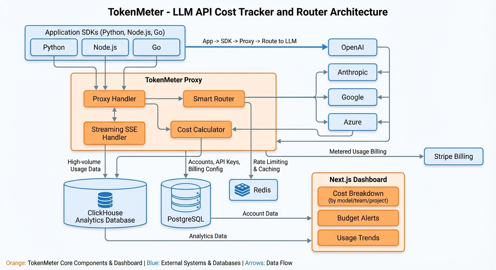
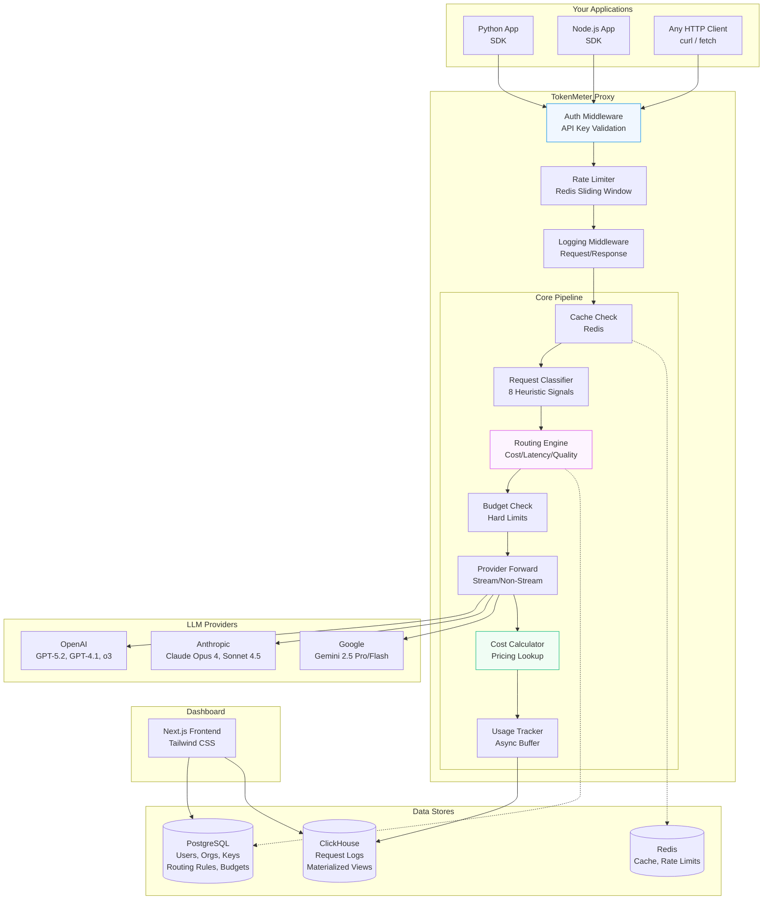
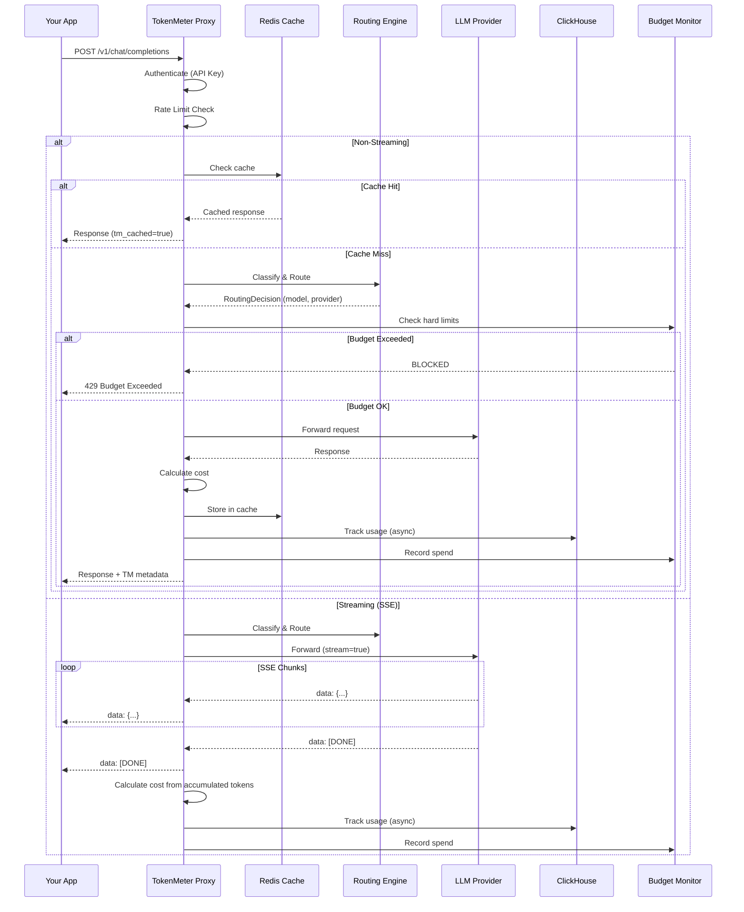
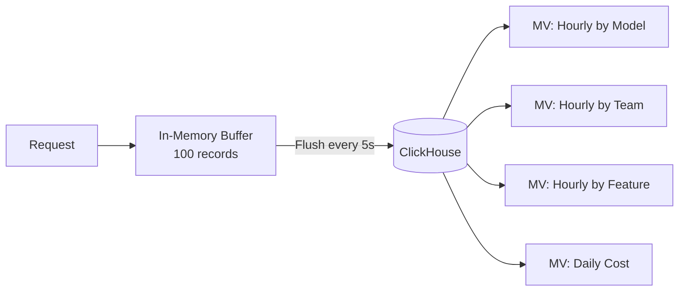
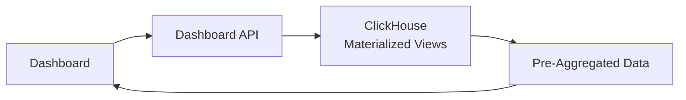
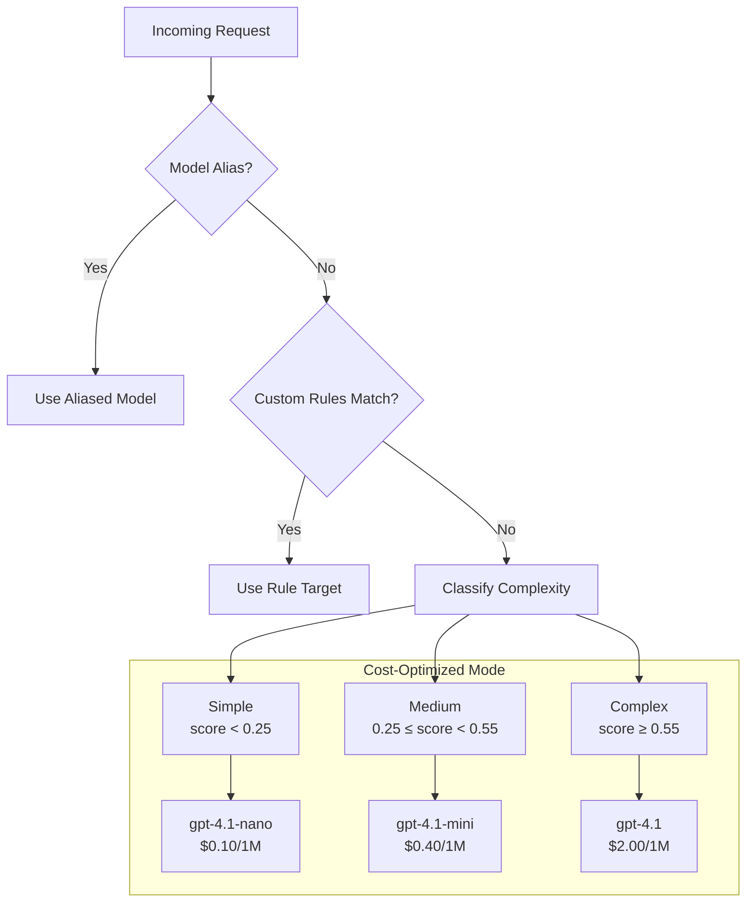

# Architecture

## System Overview

TokenMeter is a high-performance LLM API proxy that sits between your application and LLM providers (OpenAI, Anthropic, Google). Every request flows through the proxy, which adds cost tracking, smart routing, caching, and budget enforcement — all transparently and with full OpenAI API compatibility.

## High-Level Architecture





## Request Flow



## Data Pipeline

### Write Path (Request Logging)



The usage tracker uses an in-memory deque that's flushed to ClickHouse every 5 seconds or when 100 records accumulate. This provides:
- **High throughput**: No per-request DB write latency
- **Resilience**: Buffer retries on flush failure
- **Efficiency**: Batch inserts to ClickHouse

### Read Path (Dashboard)



Dashboard queries hit ClickHouse's materialized views, which pre-aggregate data hourly by org/model/team/feature. This means:
- **Sub-second queries** even with millions of rows
- **No full table scans** — aggregations are maintained incrementally
- **TTL**: Data auto-expires after 365 days

## Smart Routing Architecture



### Classification Signals

| # | Signal | Weight | Description |
|---|---|---|---|
| 1 | Message length | 0.25 | Total characters across all messages |
| 2 | Conversation depth | 0.15 | Number of user message turns |
| 3 | System prompt | 0.15 | Length and complexity of system instructions |
| 4 | Tool usage | 0.20 | Number of tool definitions |
| 5 | Keywords | ±0.25 | Domain-specific complexity indicators |
| 6 | Output length | ±0.15 | Requested max_tokens |
| 7 | Response format | 0.05 | JSON mode / structured output |
| 8 | Code patterns | 0.15 | Code blocks, imports, function defs |

## Component Details

### Backend (FastAPI)

```
backend/
├── main.py              # App entry point, lifespan events
├── config.py            # Environment-based configuration
├── models/              # Pydantic data models
│   ├── proxy.py         # OpenAI-compatible request/response
│   ├── usage.py         # Usage tracking records
│   ├── routing.py       # Routing rules & decisions
│   ├── budget.py        # Budget definitions & alerts
│   ├── provider.py      # Provider & model metadata
│   └── billing.py       # Stripe subscription models
├── services/            # Business logic
│   ├── proxy_handler.py # Core proxy lifecycle
│   ├── request_classifier.py  # Complexity classification
│   ├── routing_engine.py      # Smart routing logic
│   ├── provider_registry.py   # Provider management
│   ├── cost_calculator.py     # Cost computation
│   ├── usage_tracker.py       # Async usage logging
│   ├── budget_monitor.py      # Budget enforcement
│   ├── alert_service.py       # Alert delivery
│   ├── cache_service.py       # Response caching
│   ├── billing_service.py     # Stripe integration
│   └── analytics_service.py   # Dashboard aggregations
├── providers/           # LLM provider adapters
│   ├── base.py          # Abstract interface
│   ├── openai.py        # OpenAI adapter
│   ├── anthropic.py     # Anthropic adapter (message translation)
│   ├── google.py        # Google Gemini adapter
│   └── pricing.py       # Comprehensive pricing table
├── api/                 # HTTP route handlers
├── middleware/           # Auth, rate limiting, logging
└── utils/               # Token counting, streaming, security
```

### Database Design

**PostgreSQL** stores configuration data with referential integrity:
- Organizations, users, memberships
- API keys (hashed, never stored raw)
- Routing rules and configurations
- Budgets with threshold definitions
- Stripe subscriptions

**ClickHouse** stores time-series metrics optimized for analytical queries:
- `request_logs` — every API call (partitioned by month, ordered by org+time)
- `mv_hourly_by_model` — pre-aggregated hourly stats per model
- `mv_hourly_by_team` — pre-aggregated hourly stats per team
- `mv_hourly_by_feature` — pre-aggregated hourly stats per feature
- `mv_daily_cost` — daily cost summaries

### Streaming Architecture

TokenMeter fully supports SSE (Server-Sent Events) for streaming LLM responses:

1. Client sends request with `stream: true`
2. Proxy opens a streaming connection to the LLM provider
3. Each chunk is forwarded to the client immediately
4. Chunks are accumulated for token counting
5. On stream completion, cost is calculated and logged asynchronously

The streaming path adds <5ms overhead per request due to the async forwarding design.

## Failure Modes & Resilience

TokenMeter sits in the critical path of every LLM call. Every failure mode must be anticipated, contained, and recovered from automatically.

### Failure Mode Matrix

| Failure | Detection | Impact | Mitigation | Recovery Time |
|---------|-----------|--------|------------|---------------|
| LLM provider failure mid-stream | SSE error event / TCP timeout (30s default) | Partial response delivered to client | Return partial response with `tm_error` flag set; trigger automatic failover to backup provider if configured in routing rules | < 2s (failover) |
| ClickHouse write failure | Flush returns non-200 / connection refused | Usage data temporarily unbilled | In-memory buffer continues accumulating; retry with exponential backoff (1s, 2s, 4s, 8s, max 60s); WAL-style file backup (`/tmp/tm_wal/`) if buffer exceeds 10K records | Self-healing on ClickHouse recovery |
| Proxy overload | Request queue depth > 1000 / p99 latency > 50ms | Degraded latency for all tenants | Circuit breaker pattern (closed → half-open → open); shed load by returning 503 with `Retry-After` header; fallback to direct-to-provider URL if configured | 30s (half-open probe) |
| Budget race condition | Concurrent requests exceed hard limit | Overspend beyond configured budget | Atomic budget check using Redis `WATCH`/`MULTI` transactions; pessimistic locking with short TTL for hard limits; soft limits use eventual consistency | Immediate (atomic) |
| Token counting inaccuracy | Reconciliation job detects drift > 5% | Incorrect cost attribution | `tiktoken` for OpenAI models (exact match); heuristic estimator for Anthropic/Google (±5% tolerance); nightly reconciliation job compares estimates against provider invoices and adjusts | Nightly correction |
| Provider API format change | Integration test suite fails / response schema validation error | Requests to affected provider fail | Version-pinned HTTP clients per provider; dedicated integration test suite runs every 6 hours; automated Slack/PagerDuty alerts on response schema drift; graceful degradation returns raw provider response | Manual update (< 4h SLA) |
| Redis failure | Connection timeout / sentinel failover event | Cache misses, rate limiting disabled | Cache: proceed without caching (fail-open); Rate limiting: fall back to in-memory sliding window per instance; budget checks: use PostgreSQL as fallback (higher latency) | < 5s (sentinel failover) |
| PostgreSQL failure | Connection pool exhausted / health check fails | No new auth, no routing rule updates | Connection pooling via PgBouncer; read replicas for dashboard queries; proxy continues with last-known routing config from in-memory cache | < 30s (auto-failover) |

### Resilience Principles

1. **Proxy never blocks on analytics** — usage tracking is always async; ClickHouse failures never affect request latency
2. **Fail-open for non-critical paths** — cache miss, rate limiter down, or analytics failure should never block a legitimate request
3. **Fail-closed for budget enforcement** — if budget state is unknown, hard limits reject the request (safety over availability)
4. **Blast radius containment** — per-org circuit breakers prevent one tenant's provider issues from affecting others
5. **Graceful degradation over total failure** — every component has a degraded mode that preserves core proxy functionality

## Observability & SLOs

### Service Level Objectives

| SLO | Target | Error Budget | Measurement Window |
|-----|--------|-------------|-------------------|
| Proxy overhead latency (p99) | < 10ms (stretch: < 5ms) | N/A | Rolling 30 days |
| Proxy availability | 99.99% | 52.6 minutes/year (4.38 min/month) | Rolling 30 days |
| Data completeness (usage tracking) | > 99.9% | 525.6 seconds/year of data loss | Rolling 30 days |
| Cost calculation accuracy | > 99% | 1% drift tolerance vs provider invoices | Monthly reconciliation |

### Service Level Indicators

- **`proxy_overhead_ms`** — Histogram measuring time spent in TokenMeter logic (total latency minus upstream provider latency). Buckets: 1, 2, 5, 10, 15, 25, 50ms.
- **`upstream_latency_ms`** — Histogram of LLM provider response times, labeled by provider and model. Used for routing optimization.
- **`tokens_processed`** — Counter of input/output tokens processed, labeled by org, model, and provider. Primary billing metric.
- **`budget_checks_total`** — Counter of budget enforcement decisions, labeled by result (allowed, soft_warned, hard_blocked).
- **`cache_hit_ratio`** — Gauge of cache hit rate over 5-minute windows, labeled by org.
- **`routing_decisions`** — Counter labeled by strategy (cost_optimized, quality, latency, custom_rule, alias).
- **`buffer_size`** — Gauge of current in-memory usage buffer depth. Alert if persistently > 5K.

### Alert Thresholds

| Metric | Warning | Critical | Action |
|--------|---------|----------|--------|
| Proxy latency p99 | > 8ms | > 15ms | Scale instances / investigate middleware |
| Error rate (5xx) | > 0.01% | > 0.1% | Check provider health / circuit breakers |
| Buffer depth | > 5,000 records | > 10,000 records | Check ClickHouse connectivity |
| Budget check latency | > 5ms | > 20ms | Check Redis health |
| Cache hit rate | < 10% (if caching enabled) | < 2% | Check Redis memory / eviction policy |

### Dashboards

1. **Real-Time Proxy Performance** — Live p50/p95/p99 latency, request rate, error rate, active connections per instance
2. **Cost Analytics** — Cost breakdown by team, feature, model, and provider with daily/weekly/monthly trends
3. **Routing Decisions** — Distribution of routing strategies, model selection frequency, classification score histograms
4. **Cache Performance** — Hit rates, miss reasons, cache size, eviction rates, estimated cost savings from cache
5. **Budget Monitoring** — Current spend vs limits per org, projected overage alerts, budget utilization heatmap
6. **Provider Health** — Per-provider latency, error rates, availability, rate limit proximity

### Distributed Tracing

Every request receives a trace ID (`tm-trace-{ulid}`) that propagates through the entire pipeline:

```
SDK (client) → Proxy Auth → Rate Limiter → Cache Check → Classifier → Router → Budget Check → Provider Forward → Cost Calc → Usage Track
```

Each span is annotated with:
- **Cost**: Estimated dollar cost at the provider forwarding step
- **Routing decision**: Why this model/provider was chosen
- **Token counts**: Input and output token counts
- **Cache status**: Hit, miss, or bypass reason
- **Budget status**: Remaining budget after this request

Traces are exported via OpenTelemetry to any compatible backend (Jaeger, Tempo, Datadog).

## Disaster Recovery & Data Protection

### Proxy High Availability

- **Minimum 3 instances** deployed across 2 Fly.io regions (e.g., `iad` + `ord`, or `iad` + `lhr` for global)
- **Health checks every 5 seconds** — Fly.io automatically removes unhealthy instances from the load balancer
- **Zero-downtime deploys** — rolling deployment strategy; new instances must pass health check before old instances are drained
- **Anycast routing** — Fly.io routes to the nearest healthy instance automatically

### Analytics Data Protection

- **ClickHouse replication factor 2** — every insert is written to 2 nodes via `ReplicatedMergeTree`
- **Daily backups to S3** — full snapshot at 02:00 UTC, retained for 30 days
- **Point-in-time recovery** — ClickHouse `BACKUP` command supports incremental backups with 1-hour granularity
- **Schema migrations** — versioned and applied via CI/CD; rollback scripts maintained for every migration

### Zero-Logging Mode

When `TM_ZERO_LOGGING=true` is enabled:
- Request and response **content is never persisted** — not in ClickHouse, not in logs, not in traces
- Only **metadata** is recorded: token counts, cost, latency, model, provider, org, team, feature tag
- Cache is **disabled** (cannot cache without storing content)
- Designed for **regulated environments** (HIPAA, SOC2, GDPR) where prompt/completion content must not be stored

### RPO / RTO Targets

| Component | RTO (Recovery Time) | RPO (Recovery Point) | Mechanism |
|-----------|--------------------|--------------------|-----------|
| Proxy | < 30 seconds | N/A (stateless) | Fly.io auto-restart + health checks |
| Redis | < 5 seconds | ~1 second | Redis Sentinel automatic failover |
| PostgreSQL | < 30 seconds | 0 (synchronous replication) | Managed Postgres with auto-failover |
| ClickHouse | < 5 minutes | 5 seconds (buffer flush interval) | Replicated tables + WAL file backup |
| Analytics data | < 1 hour | 24 hours (daily backup) | S3 backup restore |

## Capacity Planning Model

### Per-Instance Resource Profile

| Resource | Value | Notes |
|----------|-------|-------|
| Concurrent connections | ~500 | FastAPI + uvicorn with 4 workers |
| Memory per request | ~50KB | Prompt + response buffer for non-streaming |
| Streaming memory | O(1) per stream | SSE chunks forwarded immediately, no full response buffering |
| Baseline memory | 25MB | 500 concurrent × 50KB |
| CPU per request | < 1ms | Token counting + cost calculation + routing decision |

### ClickHouse Write Profile

- Buffer flush interval: every **5 seconds** or **100 records** (whichever comes first)
- Maximum write rate: **20 writes/sec** to ClickHouse (batch inserts)
- Each batch insert: 1-100 records, ~20KB-2MB payload
- ClickHouse ingestion capacity: far exceeds proxy write rate (ClickHouse handles millions of rows/sec)

### Scaling Tiers

| Scale | Requests/Day | Sustained RPS | Peak RPS | Fly.io Instances | ClickHouse | Redis | Estimated Infra Cost |
|-------|-------------|---------------|----------|-----------------|------------|-------|---------------------|
| Startup | 10K | 0.12 | 0.5 | 2 (shared-cpu) | Shared | Shared | ~$20/mo |
| Growth | 100K | 1.2 | 5 | 3 (shared-cpu) | Shared | Dedicated | ~$80/mo |
| Scale | 1M | 12 | 50 | 10 (dedicated-cpu) | Dedicated instance | Dedicated cluster | ~$500/mo |
| Enterprise | 10M | 120 | 500 | 30+ (dedicated-cpu, multi-region) | Clustered (3 shards) | Clustered (3 nodes) | ~$3,000/mo |

### Network Bandwidth

- Average request payload: **2KB** (prompt + metadata)
- Average response payload: **4KB** (completion + usage metadata)
- Per-request transfer: **~6KB**
- At 1M requests/day: **6GB/day** transfer (~180GB/month)
- Streaming adds negligible overhead (same data, chunked delivery)

### ClickHouse Storage

- Record size: 25 fields × ~200 bytes average = **~5KB per record** (raw)
- ClickHouse compression ratio: **~10x** (LZ4 + column-oriented storage)
- Effective storage per record: **~500 bytes** compressed
- At 1M requests/day: **200MB/day raw → ~20MB/day compressed**
- Annual storage at 1M/day: **~7.3GB compressed** (well within single-node capacity)
- TTL auto-expiry at 365 days keeps storage bounded
